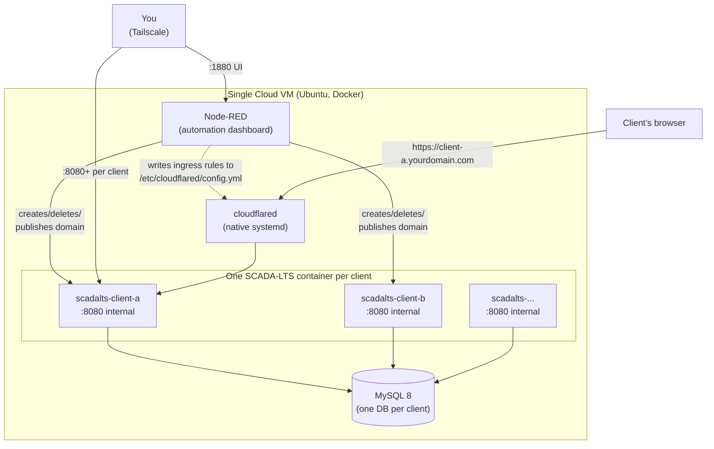

# SCADA-LTS Multi-Tenant Deploy Guide

*[Leia em português](README.pt-BR.md)*

A from-scratch, step-by-step guide to running a **multi-tenant SCADA-LTS
setup on a single cloud VM**: one shared MySQL instance, one isolated
SCADA-LTS container per client, each with its own branded login/theme, and
a **Node-RED automation** that provisions/publishes/deletes clients through
a web form instead of manual clicking.

No real client name, IP, or secret anywhere in this repo — every value that
needs to be real is a `<placeholder>` or `__ENV_VAR__`.

## Architecture



No inbound port is ever opened to the public internet for the app itself —
access is either through Tailscale (private mesh network, for you) or
through Cloudflare Tunnel (outbound-only connection from the VM, for
clients with a public domain).

## 1. What you'll end up with

- One Linux VM running **MySQL** (one database per client) + **N SCADA-LTS
  instances** (one per client, each its own Docker container) + **Node-RED**
  (automation for creating/deleting a client and publishing a domain).
- Each client reachable two ways: an internal IP (Tailscale, for you to
  administer) and optionally a public domain
  (`<client>.yourdomain.com`, via Cloudflare Tunnel — no open port).
- A web form (Node-RED Dashboard) where you type the client's name/color/
  login and it provisions everything by itself in 2-4 minutes.

## 2. Provision the VM

Any cloud provider works; this project uses Hetzner Cloud (good
price/performance, EU/US datacenters).

- **Minimum specs**: 2 vCPU, 4GB RAM for a handful of clients (~3-5). Each
  SCADA-LTS instance uses ~350-500MB RAM; budget
  `500MB × concurrent clients + 1GB for MySQL/Node-RED/OS`.
- **OS**: Ubuntu 24.04 LTS.
- **Cost**: a Hetzner `cx23`-class VM (2 vCPU/4GB) runs roughly €6-7/month
  at the time of writing — check current pricing, this changes.
- Note the public IP — you'll need it for SSH and the Cloudflare Tunnel.

## 3. Ports — what actually needs to be open

**Short answer: no application port needs to be open to the internet.**
Public access is only through the Cloudflare Tunnel (outbound connection
from the VM, not inbound).

| Port | Service | Exposure |
|---|---|---|
| 22 | SSH | Your IP only, or better: Tailscale-only |
| 3306 | MySQL | Never exposed — internal Docker network only |
| 8080+ (one per client) | SCADA-LTS (Tomcat) | Only on the VM's Tailscale IP (private mesh network) |
| 1880 | Node-RED (automation dashboard) | Only on the VM's Tailscale IP |
| — | Cloudflare Tunnel | No port — outbound connection from the VM to Cloudflare |
| 6000-6100 (if using ABS Cel modems) | Gateway's Modbus bridge | Internal Docker network only, between Gateway and SCADA-LTS |

Install **Tailscale** on the VM (`curl -fsSL https://tailscale.com/install.sh | sh`,
then `tailscale up`) — that's how you reach everything without opening a
single port to the world.

## 4. Install Docker

```bash
curl -fsSL https://get.docker.com | sh
sudo usermod -aG docker $USER
```

## 5. Bring up MySQL (shared database)

Create `/opt/scadalts/stack/docker-compose.yml`:

```yaml
services:
  database:
    container_name: mysql
    image: mysql/mysql-server:8.0.32
    restart: unless-stopped
    environment:
      - MYSQL_ROOT_PASSWORD=<strong-password-here>
      - MYSQL_USER=scadalts
      - MYSQL_PASSWORD=<strong-password-here>
      - MYSQL_DATABASE=scadalts
    volumes:
      - ./db_data:/var/lib/mysql:rw
    command: --log_bin_trust_function_creators=1
```

```bash
cd /opt/scadalts/stack && docker compose up -d
```

## 6. SCADA-LTS image — what to pull

**No `.jar` to download by hand** — the `scadalts/scadalts` Docker image
already ships SCADA-LTS (Tomcat + WAR) ready to go.

```bash
docker pull scadalts/scadalts:v2.7.8.1
```

**Important: pin the version, don't use `:latest`.** At the time this guide
was written, `:latest` resolves to `v2.8.0`, which the SCADA-LTS team
themselves mark as a **prerelease** on GitHub — not the recommended stable
version for production. Check the current release at
[github.com/SCADA-LTS/Scada-LTS/releases](https://github.com/SCADA-LTS/Scada-LTS/releases)
before pinning.

## 7. ABS Gateway/Master (only if using ABS Cel modems)

If a client has an ABS Cel cellular modem doing the Modbus bridge, you need
ABS Telemetria's proprietary Docker images (`abs-gateway`, `abs-master`) —
request registry access from them, they're not public. Without an ABS
modem, skip this step (the client can have another data source type,
configured as a different Data Source inside SCADA-LTS itself).

## 8. Cloudflare Tunnel

1. In the Cloudflare Zero Trust dashboard, create a new tunnel, note the
   `tunnel id`, and download the credentials file (`.json`).
2. Install `cloudflared` on the VM:
   ```bash
   curl -L https://github.com/cloudflare/cloudflared/releases/latest/download/cloudflared-linux-amd64 -o /usr/bin/cloudflared
   chmod +x /usr/bin/cloudflared
   ```
3. `/etc/cloudflared/config.yml`:
   ```yaml
   tunnel: <your-tunnel-id>
   credentials-file: /etc/cloudflared/<your-tunnel-id>.json
   ingress:
     - service: http_status:404
   ```
4. Systemd service to keep it running:
   ```bash
   cloudflared service install
   systemctl enable --now cloudflared
   ```

**Automatic reload watcher** — since every new client needs a new line
under `ingress:`, and manually restarting `cloudflared` every time is
annoying/easy to forget, set up a systemd watcher that restarts it by
itself whenever the file changes (files provided in
`systemd/cloudflared-reload.path` and `systemd/cloudflared-reload.service`
in this repo):

```bash
cp systemd/cloudflared-reload.* /etc/systemd/system/
systemctl daemon-reload
systemctl enable --now cloudflared-reload.path
```

## 9. Node-RED (client automation)

```bash
mkdir -p /opt/node-red/data
```

`/opt/node-red/docker-compose.yml`:

```yaml
services:
  node-red:
    build: .
    image: node-red-com-docker
    container_name: node-red
    restart: unless-stopped
    user: root
    ports:
      - "<VM_TAILSCALE_IP>:1880:1880"
    volumes:
      - ./data:/data
      - /var/run/docker.sock:/var/run/docker.sock
      - /opt/scadalts/stack:/opt/scadalts/stack
      - /etc/cloudflared/config.yml:/etc/cloudflared/config.yml
      - /opt/_backups_pre_reorg:/opt/_backups_pre_reorg
    networks:
      - default
      - scadalts_net
networks:
  default: {}
  scadalts_net:
    external: true
    name: stack_default
```

`Dockerfile` next to it (the base Node-RED image doesn't ship Docker CLI or
PyYAML, and the automation flow needs both):

```dockerfile
FROM nodered/node-red:latest
USER root
RUN apk add --no-cache docker-cli docker-cli-compose py3-yaml
USER node-red
```

```bash
cd /opt/node-red && docker compose up -d
```

Copy `node-red-flows/flows.json` from this repo to
`/opt/node-red/data/flows.json` — this is the **full, real** automation, not
a description, import it directly: client creation form (name, 12-color
palette, login/password with confirmation), live progress bar, "Publish
domain" button, "Delete" button with master password + automatic backup, a
lock preventing two heavy operations from running at once. Before starting,
swap the placeholders in the file:

| Placeholder | What it is |
|---|---|
| `__CF_API_TOKEN__` | Cloudflare API token (see below) |
| `__CF_ZONE_ID__` | Zone/domain ID in Cloudflare (Dashboard → your domain → right sidebar) |
| `__CF_TUNNEL_ID__` | Tunnel ID created in step 8 |
| `__TAILSCALE_IP_DA_VM__` | Your VM's Tailscale IP |
| `__SEU_DOMINIO__` | Your domain (e.g. `example.com`) |
| `__MYSQL_ROOT_PASSWORD__` | MySQL password set in step 5 |
| `__MASTER_PASSWORD_EXCLUIR__` | Password you choose to confirm client deletion |

Also copy `node-red-flows/novo_cliente.py` from this repo to
`/opt/scadalts/stack/scripts/novo_cliente.py` — it's the script the flow
calls to create the database/container. **This file needs two placeholders
swapped, not one**: `__TAILSCALE_IP_DA_VM__` *and* `__MYSQL_ROOT_PASSWORD__`
(it runs `mysql -u root -p...` directly). Skipping the second one fails with
`ERROR 1045 (28000): Access denied for user 'root'@'localhost'` the first
time you try to create a client.

Finally, copy the branding templates from `node-red-flows/templates/` (see
section 10 below) to `/opt/scadalts/stack/_template/` — `novo_cliente.py`
expects them there and will fail if the folder doesn't exist:

```bash
mkdir -p /opt/scadalts/stack/_template
cp node-red-flows/templates/* /opt/scadalts/stack/_template/
```

The base `nodered/node-red` image does **not** ship with the dashboard UI
or the MySQL node — `flows.json` needs both. Install them before restarting:

```bash
docker exec node-red sh -c 'cd /data && npm install node-red-dashboard node-red-node-mysql'
```

Restart the Node-RED container after placing all the files above and
installing these two packages.

**Cloudflare token for the "Publish domain" button**: create one at
[dash.cloudflare.com/profile/api-tokens](https://dash.cloudflare.com/profile/api-tokens),
permissions `Zone → DNS → Edit` + `Account → Cloudflare Tunnel → Edit`,
scoped to your zone only.

## 9b. What a client's service looks like in `docker-compose.yml`

`novo_cliente.py` automatically appends a block like this (real example,
generated by the script) — this is what ties together database, container,
theme, and domain into one thing:

```yaml
services:
  scadalts-<name>:
    image: scadalts/scadalts:v2.7.8.1
    restart: unless-stopped
    environment:
      - CATALINA_OPTS=-Xmx384m -Xms192m
      - TZ=America/Sao_Paulo
    ports:
      - <VM_TAILSCALE_IP>:<port>:8080
    depends_on:
      - database
    volumes:
      - ./clients/<name>/tomcat_log:/usr/local/tomcat/logs:rw
      - ./clients/<name>/context.xml:/usr/local/tomcat/webapps/Scada-LTS/META-INF/context.xml:ro
      - ./clients/<name>/env.properties:/usr/local/tomcat/webapps/Scada-LTS/WEB-INF/classes/env.properties:ro
      - ./clients/<name>/graphics:/usr/local/tomcat/webapps/Scada-LTS/graphics:rw
      - ./clients/<name>/login/login-theme.css:/usr/local/tomcat/webapps/Scada-LTS/assets/login-theme.css:ro
      - ./clients/<name>/login/<name>-logo.png:/usr/local/tomcat/webapps/Scada-LTS/assets/<name>-logo.png:ro
      - ./clients/<name>/login/login.jsp:/usr/local/tomcat/webapps/Scada-LTS/WEB-INF/jsp/login.jsp:ro
    links:
      - database:database
    command:
      - /usr/bin/wait-for-it
      - --host=database
      - --port=3306
      - --timeout=60
      - --strict
      - --
      - /usr/local/tomcat/bin/catalina.sh
      - run
```

`Xmx384m` is deliberately modest — a single SCADA-LTS instance doesn't need
much RAM on its own; tune it to the client's actual data/graphics volume.
`wait-for-it` makes sure Tomcat only tries to start after MySQL is up
(avoids a connection error on first boot).

## 10. The branded login/home pages

Stock SCADA-LTS has a generic login screen and a technical "watch list" home
— to give each client their own color/logo, `novo_cliente.py` (step 9)
swaps 4 files inside the container before starting it, using this repo's
templates in `node-red-flows/templates/`:

| File | Purpose | Placeholders | Where it lands in the container |
|---|---|---|---|
| `login.jsp` | Replaces the default SCADA-LTS login screen | `{{CLIENTE_NOME}}`, `{{LOGO_FILENAME}}` | `WEB-INF/jsp/login.jsp` (bind mount `:ro`) |
| `login-theme.css` | Theme color applied on the login screen | `{{CLIENTE_NOME}}`, `{{COR_TEMA}}`, `{{COR_TEMA_HOVER}}` | `assets/login-theme.css` (bind mount `:ro`) |
| `home.html` | Custom landing page the client sees after logging in (instead of the default technical "watch list") | `{{CLIENTE_NOME}}`, `{{COR_TEMA}}`, `{{LOGO_FILENAME}}` | inside the `graphics/` folder, mounted whole (`graphics:rw`) — that's where the client's login points (`homeUrl: /graphics/home.html`) |
| `context.xml` | Points Tomcat at the right MySQL database for this client | `{{NOME_CLIENTE}}`, `{{DB_SENHA}}` | `META-INF/context.xml` (bind mount `:ro`) |
| `env.properties` | Standard SCADA-LTS config (no placeholder, copied as-is for every client) | — | `WEB-INF/classes/env.properties` (bind mount `:ro`) |

**How the substitution works**: the script reads each template, swaps
`{{PLACEHOLDER}}` for the real value (client name, hex color picked in the
form, logo filename), writes the result to
`/opt/scadalts/stack/clients/<name>/`, and the generated
`docker-compose.yml` service (section 9b) mounts each file **on top of**
SCADA-LTS's default file inside the image via `volumes:` — one mount per
file, plus one whole-folder mount (`graphics/`) for `home.html` + the logo.

To swap the **logo**: drop the client's PNG at
`/opt/scadalts/stack/clients/<name>/graphics/<name>-logo-full.png` (used in
`home.html`) and `/opt/scadalts/stack/clients/<name>/login/<name>-logo.png`
(used in `login.jsp`) — `novo_cliente.py` already knows how to mount those
paths, the files just need to exist before the container starts.

## 11. Create your first client

With everything up: open the Node-RED dashboard, "New Client" tab, fill in
name/color/login, click Create. Watch the progress bar (takes 2-4 minutes,
most of it is Tomcat booting). At the end, the client shows up in the
"Active Clients" tab with an access link — click "Publish domain" there if
you want a public link too.

## Summary of "what to download"

| What | From where | Needs an account/token? |
|---|---|---|
| SCADA-LTS image | `docker pull scadalts/scadalts:v2.7.8.1` | No |
| MySQL image | `docker pull mysql/mysql-server:8.0.32` | No |
| `cloudflared` | Cloudflare's GitHub releases | No (but you need a Cloudflare account to create the tunnel) |
| ABS Gateway/Master images | ABS Telemetria's private registry | Yes, only if using an ABS Cel modem |
| `flows.json`, `novo_cliente.py`, templates | This repo | No |

## Known gaps (honest, not swept under the rug)

- **Not yet validated end-to-end on a fresh VM** by an independent run of
  this exact guide — it reflects a real, working deployment, but the guide
  itself hasn't been dry-run from a blank VM top to bottom.
- **No automated client-database backup yet** — only the "Delete" flow
  backs up a specific client's database, right before removing it. There's
  no periodic backup of the databases still running.
- **No CI/tests** — this is documentation + config templates, not a tested
  codebase.

## License

MIT — see [`LICENSE`](LICENSE). SCADA-LTS itself and any third-party
component (ABS Gateway/Master, Cloudflare) keep their own licenses.
