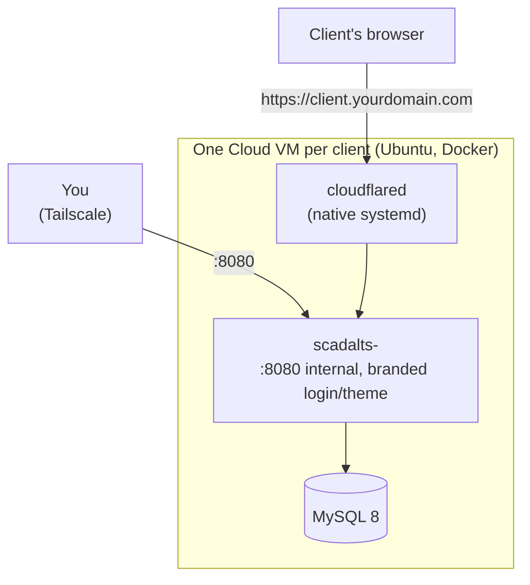

# SCADA-LTS Deploy Guide

*[Leia em português](README.pt-BR.md)*

A from-scratch, step-by-step guide to deploying a **branded SCADA-LTS
instance for one client on one cloud VM**: Docker, MySQL, the SCADA-LTS
container itself, an optional physical-modem bridge, a custom
login/theme/logo for that client, and a public domain via Cloudflare
Tunnel — no open inbound port anywhere.

No real client name, IP, or secret anywhere in this repo — every value that
needs to be real is a `<placeholder>` or `__ENV_VAR__`.

## Architecture



No inbound port is ever opened to the public internet for the app itself —
access is either through Tailscale (private mesh network, for you) or
through Cloudflare Tunnel (outbound-only connection from the VM, for the
client's public domain).

**Why one VM per client, not one shared VM for everyone**: full isolation.
If one client's VM has a problem, no other client is affected — no shared
database, no shared container runtime, no blast radius. It also means each
VM's cost maps directly to one client's invoice.

## 1. What you'll end up with

- One Linux VM running **MySQL** + **one SCADA-LTS instance**, branded with
  that client's name/color/logo.
- The client reachable two ways: an internal IP (Tailscale, for you to
  administer) and a public domain (`<client>.yourdomain.com`, via
  Cloudflare Tunnel — no open port).
- Optionally, a physical Modbus bridge (section 7) if the client has an ABS
  Cel cellular modem instead of another data source type.

## 2. Provision the VM

Any cloud provider works; this project uses Hetzner Cloud (good
price/performance, EU/US datacenters).

- **Minimum specs**: 2 vCPU, 4GB RAM — one SCADA-LTS instance uses
  ~350-500MB RAM, the rest is MySQL/OS/headroom.
- **OS**: Ubuntu 24.04 LTS.
- **Cost**: a Hetzner `cx23`-class VM (2 vCPU/4GB) runs roughly €6-7/month
  at the time of writing — check current pricing, this changes.
- Note the public IP — you'll need it for SSH and the Cloudflare Tunnel.

## 3. Ports — what actually needs to be open

**Short answer: no application port needs to be open to the internet.**
Public access is only through the Cloudflare Tunnel (outbound connection
from the VM, not inbound).

| Port | Service | Exposure |
|---|---|---|
| 22 | SSH | Your IP only, or better: Tailscale-only |
| 3306 | MySQL | Never exposed — internal Docker network only |
| 8080 | SCADA-LTS (Tomcat) | Only on the VM's Tailscale IP (private mesh network) |
| — | Cloudflare Tunnel | No port — outbound connection from the VM to Cloudflare |
| 6000+ (if using an ABS Cel modem) | Gateway's Modbus bridge | Internal Docker network only, between Gateway and SCADA-LTS |

Install **Tailscale** on the VM (`curl -fsSL https://tailscale.com/install.sh | sh`,
then `tailscale up`) — that's how you reach it without opening a single
port to the world.

## 4. Install Docker

```bash
curl -fsSL https://get.docker.com | sh
sudo usermod -aG docker $USER
```

## 5. Bring up MySQL

Create `/opt/scadalts/stack/docker-compose.yml`:

```yaml
services:
  database:
    container_name: mysql
    image: mysql/mysql-server:8.0.32
    restart: unless-stopped
    environment:
      - MYSQL_ROOT_PASSWORD=<strong-password-here>
      - MYSQL_USER=scadalts
      - MYSQL_PASSWORD=<strong-password-here>
      - MYSQL_DATABASE=scadalts
    volumes:
      - ./db_data:/var/lib/mysql:rw
    command: --log_bin_trust_function_creators=1
```

```bash
cd /opt/scadalts/stack && docker compose up -d
```

## 6. SCADA-LTS image — what to pull

**No `.jar` to download by hand** — the `scadalts/scadalts` Docker image
already ships SCADA-LTS (Tomcat + WAR) ready to go.

```bash
docker pull scadalts/scadalts:v2.7.8.1
```

**Important: pin the version, don't use `:latest`.** At the time this guide
was written, `:latest` resolves to `v2.8.0`, which the SCADA-LTS team
themselves mark as a **prerelease** on GitHub — not the recommended stable
version for production. Check the current release at
[github.com/SCADA-LTS/Scada-LTS/releases](https://github.com/SCADA-LTS/Scada-LTS/releases)
before pinning.

## 7. ABS Gateway/Master (only if the client has an ABS Cel modem)

If the client has an ABS Cel cellular modem doing the Modbus bridge, you
need ABS Telemetria's proprietary Docker images (`abs-gateway`,
`abs-master`) — request registry access from them, they're not public.
Without an ABS modem, skip this whole section (the client can have another
data source type, configured as a Data Source inside SCADA-LTS itself).

**`docker-compose.yml`** (separate stack, e.g. `/opt/abs/docker-compose.yml`):

```yaml
services:
  abs_gateway:
    image: swr.abstelemetria.com/abs-gateway:v1.20
    container_name: abs_gateway
    command: -port=<ABS_GATEWAY_PORT> -mport=<ABS_GATEWAY_PORT>
    network_mode: "host"
    tty: true
    stdin_open: true
    restart: unless-stopped
    pids_limit: 65535
    ulimits:
      nproc: 65535

  master_main:
    image: swr.abstelemetria.com/abs-master:v6.02
    container_name: master_main
    network_mode: "host"
    tty: true
    stdin_open: true
    restart: unless-stopped
    volumes:
      - ./master_main/portas.txt:/opt/abs/portas.txt
      - ./master_main/master.txt:/opt/abs/master.txt
    pids_limit: 65535
    ulimits:
      nproc: 65535
```

**`master_main/master.txt`** — just a static ID:
```
master_id = 1
#
```

**`master_main/portas.txt`** — maps TCP port ↔ modem ID. On a
one-client-per-VM setup this file only ever has one line (this client's
modem), since there's nothing else sharing the Gateway:
```
<BRIDGE_PORT>=<MODEM_ID>
#
```

Both images pull from `swr.abstelemetria.com` — no `docker login` needed
once you have registry access.

**Why `network_mode: host`**: both containers need the ABS modem port and
the Modbus bridge port exposed directly on the VM's network interfaces, not
behind Docker's bridge network — that's how the physical modem (and
SCADA-LTS's Modbus client) reach them.

**Data Source config in SCADA-LTS — settings that actually work** (found
by trial and error, the defaults don't):

| Field | Value | Why |
|---|---|---|
| Host | Docker bridge gateway IP (e.g. `172.18.0.1`, check with `docker network inspect`) | Not `localhost` — the SCADA-LTS container needs the host-side bridge address |
| Port | the bridge port from `portas.txt` | |
| Transport type | `TCP keep-alive` | |
| Timeout (ms) | `4500` | The default 500ms fails with "no response from network" — round-trip over 4G to the modem is much slower than LAN |
| Retries | `3` | |
| Encapsulated | **checked/true** | Critical — forces modbus4j to build the frame with a full MBAP header, which is what the ABS master/datalogger expects on this channel |
| Slave ID (readings) | `1` | The `200` from the ABS manual is only for direct serial access, not through the Gateway's TCP bridge |
| Offset | same as the point's real register number | Despite the UI label saying "Offset (0-based)", it is **not** 0-based in practice on this bridge — subtracting 1 breaks the reading |

## 8. Cloudflare Tunnel

1. In the Cloudflare Zero Trust dashboard, create a new tunnel, note the
   `tunnel id`, and download the credentials file (`.json`).
2. Install `cloudflared` on the VM:
   ```bash
   curl -L https://github.com/cloudflare/cloudflared/releases/latest/download/cloudflared-linux-amd64 -o /usr/bin/cloudflared
   chmod +x /usr/bin/cloudflared
   ```
3. `/etc/cloudflared/config.yml`:
   ```yaml
   tunnel: <your-tunnel-id>
   credentials-file: /etc/cloudflared/<your-tunnel-id>.json
   ingress:
     - hostname: <client>.yourdomain.com
       service: http://<VM_TAILSCALE_IP>:8080
     - service: http_status:404
   ```
4. Systemd service to keep it running:
   ```bash
   cloudflared service install
   systemctl enable --now cloudflared
   ```

One VM, one client, one `ingress` rule — no watcher/automation needed here,
you write the file once when you set the VM up.

## 9. Create the client — branding + bring-up

Stock SCADA-LTS has a generic login screen and a technical "watch list"
home page. To give this client their own name/color/logo, you swap 4 files
inside the container **before** starting it, using the templates in this
repo's `templates/` folder.

**9.1 — Render the templates.** Pick the client's name (lowercase,
no spaces/accents — it becomes the database name), a theme color, and a
DB password. Then:

```bash
NOME=<client-name>       # e.g. acme
COR=<#hex-color>          # e.g. #1b5c94
DB_SENHA=<strong-password>

mkdir -p /opt/scadalts/stack/clients/$NOME/login \
         /opt/scadalts/stack/clients/$NOME/graphics \
         /opt/scadalts/stack/clients/$NOME/tomcat_log

cd templates   # this repo's templates/ folder

sed "s/{{NOME_CLIENTE}}/$NOME/g; s/{{DB_SENHA}}/$DB_SENHA/g" \
  context.xml > /opt/scadalts/stack/clients/$NOME/context.xml

cp env.properties /opt/scadalts/stack/clients/$NOME/env.properties

sed "s/{{COR_TEMA}}/$COR/g; s/{{LOGO_FILENAME}}/${NOME}-logo.png/g" \
  login-theme.css > /opt/scadalts/stack/clients/$NOME/login/login-theme.css

sed "s/{{CLIENTE_NOME}}/$NOME/g" \
  login.jsp > /opt/scadalts/stack/clients/$NOME/login/login.jsp

sed "s/{{LOGO_FILENAME}}/${NOME}-logo.png/g" \
  home.html > /opt/scadalts/stack/clients/$NOME/graphics/home.html
```

Drop the client's actual logo (PNG) at
`/opt/scadalts/stack/clients/$NOME/login/$NOME-logo.png` — that's the file
`login.jsp` and `home.html` reference.

| File | Purpose | Where it lands in the container |
|---|---|---|
| `login.jsp` | Replaces the default login screen | `WEB-INF/jsp/login.jsp` (bind mount `:ro`) |
| `login-theme.css` | Theme color on the login screen | `assets/login-theme.css` (bind mount `:ro`) |
| `home.html` | Landing page after login (instead of the default technical "watch list") | inside `graphics/`, mounted whole — the login points here (`homeUrl: /graphics/home.html`) |
| `context.xml` | Points Tomcat at this client's MySQL database | `META-INF/context.xml` (bind mount `:ro`) |
| `env.properties` | Standard SCADA-LTS config, no placeholders, copied as-is | `WEB-INF/classes/env.properties` (bind mount `:ro`) |

**9.2 — Create the database.**

```bash
docker exec mysql mysql -u root -p<mysql-root-password> -e \
  "CREATE DATABASE IF NOT EXISTS scadalts_$NOME;
   CREATE USER IF NOT EXISTS 'scadalts_$NOME'@'%' IDENTIFIED BY '$DB_SENHA';
   GRANT ALL PRIVILEGES ON scadalts_$NOME.* TO 'scadalts_$NOME'@'%';
   FLUSH PRIVILEGES;"
```

**9.3 — Add the service to `docker-compose.yml`.** Append this block
(don't re-run a full `yaml.dump`/rewrite of the file if you're scripting
this — see the note below on why):

```yaml
  scadalts-<name>:
    image: scadalts/scadalts:v2.7.8.1
    restart: unless-stopped
    environment:
      - CATALINA_OPTS=-Xmx384m -Xms192m
      - TZ=America/Sao_Paulo
    ports:
      - <VM_TAILSCALE_IP>:8080:8080
    depends_on:
      - database
    volumes:
      - ./clients/<name>/tomcat_log:/usr/local/tomcat/logs:rw
      - ./clients/<name>/context.xml:/usr/local/tomcat/webapps/Scada-LTS/META-INF/context.xml:ro
      - ./clients/<name>/env.properties:/usr/local/tomcat/webapps/Scada-LTS/WEB-INF/classes/env.properties:ro
      - ./clients/<name>/graphics:/usr/local/tomcat/webapps/Scada-LTS/graphics:rw
      - ./clients/<name>/login/login-theme.css:/usr/local/tomcat/webapps/Scada-LTS/assets/login-theme.css:ro
      - ./clients/<name>/login/<name>-logo.png:/usr/local/tomcat/webapps/Scada-LTS/assets/<name>-logo.png:ro
      - ./clients/<name>/login/login.jsp:/usr/local/tomcat/webapps/Scada-LTS/WEB-INF/jsp/login.jsp:ro
    links:
      - database:database
    command:
      - /usr/bin/wait-for-it
      - --host=database
      - --port=3306
      - --timeout=60
      - --strict
      - --
      - /usr/local/tomcat/bin/catalina.sh
      - run
```

`Xmx384m` is deliberately modest — a single SCADA-LTS instance doesn't need
much RAM on its own; tune it to the client's actual data/graphics volume.
`wait-for-it` makes sure Tomcat only tries to start after MySQL is up
(avoids a connection error on first boot).

> **Why append instead of rewrite the whole file**: parsing the entire
> `docker-compose.yml` with a YAML library and dumping it back reformats
> the whole file — and Docker Compose computes a per-service config hash
> from the file's current content. Even an unrelated formatting change can
> make it think `database` (MySQL) changed too, and **silently recreate
> it** the next time you run `docker compose up` — right as this new
> client's SCADA-LTS is trying to connect to the database for the first
> time. Found this the hard way; append-only (or a surgical text edit that
> touches only this client's block) avoids it entirely.

```bash
cd /opt/scadalts/stack && docker compose up -d scadalts-$NOME
```

**9.4 — Wait for it, then check.**

```bash
until curl -s -o /dev/null -w '%{http_code}' http://<VM_TAILSCALE_IP>:8080/Scada-LTS/login.htm | grep -q 200; do
  sleep 3
done
echo "up"
```

Open `http://<vm-tailscale-ip>:8080/Scada-LTS/login.htm` — you should see
the branded login screen (client name, chosen color). Log in with
SCADA-LTS's default admin, create the client's actual users from there.

**9.5 — Make each user land on the custom home page, not the default
watch list.** Without this step, logging in shows SCADA-LTS's stock
"watch list" screen, not the `home.html` you branded in step 9.1 — this
field is per-user and isn't set by anything above.

For each user (including `admin`, or whichever account the client will
actually use): `Users → <username> → Home URL` field, set to:

```
graphics/home.html
```

**Must be exactly this — a relative path, no leading slash, no domain.**
A value like `/graphics/home.html` or a full URL breaks the post-login
redirect (it 404s on a mangled `/S/...` path) — this isn't a typo risk,
it's how SCADA-LTS's own `parseHomeUrl()` only strips *leading* slashes,
so a value that isn't already relative stays broken. Save, log out, log
back in to confirm it lands on the branded home page.

## Summary of "what to download"

| What | From where | Needs an account/token? |
|---|---|---|
| SCADA-LTS image | `docker pull scadalts/scadalts:v2.7.8.1` | No |
| MySQL image | `docker pull mysql/mysql-server:8.0.32` | No |
| `cloudflared` | Cloudflare's GitHub releases | No (but you need a Cloudflare account to create the tunnel) |
| ABS Gateway/Master images | ABS Telemetria's private registry | Yes, only if using an ABS Cel modem |
| Branding templates (`templates/`) | This repo | No |

## Known gaps (honest, not swept under the rug)

- **No automated client-database backup** — you're responsible for backing
  up `db_data` and the client's config yourself; nothing in this repo does
  it for you.
- **No CI/tests** — this is documentation + config templates, not a tested
  codebase.
- **Multiple clients sharing one VM/database** is a different, more
  advanced pattern (shared SCADA-LTS instance, restricted per-user
  permissions instead of separate containers) that this guide intentionally
  doesn't cover — it trades isolation for lower cost, and needs its own
  automation to be manageable at scale.

## License

MIT — see [`LICENSE`](LICENSE). SCADA-LTS itself and any third-party
component (ABS Gateway/Master, Cloudflare) keep their own licenses.
