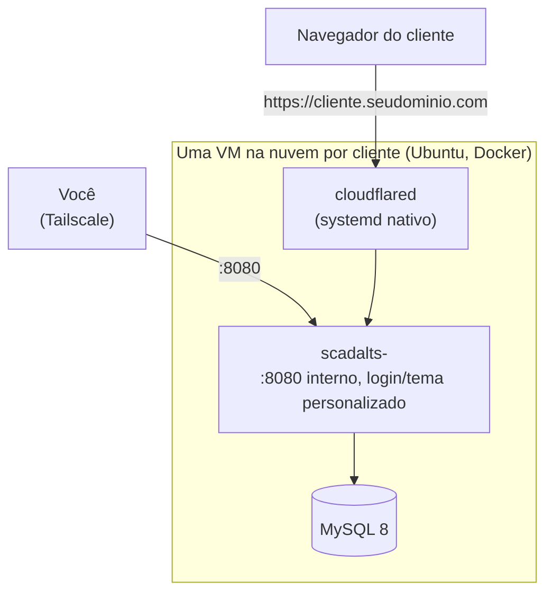

# Guia de Deploy SCADA-LTS

*[Read in English](README.md)*

Passo a passo do zero pra fazer deploy de uma **instância SCADA-LTS
personalizada pra um cliente numa VM na nuvem**: Docker, MySQL, o
container do SCADA-LTS em si, ponte opcional com modem físico, tema/logo
personalizado pra esse cliente, e domínio público via Cloudflare Tunnel —
sem nenhuma porta aberta pra internet.

Sem nome de cliente real, IP ou segredo em lugar nenhum deste repo — todo
valor que precisa ser real é um `<placeholder>` ou `__VAR_AMBIENTE__`.

## Arquitetura



Nenhuma porta de entrada é aberta pra internet pública pra aplicação em
si — o acesso é sempre via Tailscale (rede mesh privada, pra você) ou via
Cloudflare Tunnel (conexão de saída da VM, pro domínio público do
cliente).

**Por que uma VM por cliente, não uma VM compartilhada pra todo mundo**:
isolamento total. Se a VM de um cliente tiver problema, nenhum outro
cliente é afetado — sem banco compartilhado, sem runtime de container
compartilhado, sem raio de explosão. Também significa que o custo de cada
VM mapeia direto pra fatura de um cliente.

## 1. O que você vai ter no final

- Uma VM Linux rodando **MySQL** + **uma instância SCADA-LTS**,
  personalizada com nome/cor/logo desse cliente.
- O cliente acessível de dois jeitos: um IP interno (Tailscale, pra você
  administrar) e um domínio público (`<cliente>.seudominio.com`, via
  Cloudflare Tunnel — sem porta aberta).
- Opcionalmente, uma ponte Modbus física (seção 7) se o cliente tiver um
  modem celular ABS Cel em vez de outro tipo de fonte de dado.

## 2. Provisionar a VM

Qualquer provedor cloud serve; este projeto usa Hetzner Cloud (bom
custo-benefício, datacenter Europa/EUA).

- **Specs mínimas**: 2 vCPU, 4GB RAM — uma instância SCADA-LTS usa uns
  350-500MB de RAM, o resto é MySQL/SO/folga.
- **SO**: Ubuntu 24.04 LTS.
- **Custo**: uma VM classe `cx23` da Hetzner (2 vCPU/4GB) fica em torno de
  €6-7/mês no momento em que isso foi escrito — confira o preço atual,
  isso muda.
- Anote o IP público — vai precisar pra SSH e pro Cloudflare Tunnel.

## 3. Portas — o que precisa abrir de verdade

**Resposta curta: nenhuma porta de aplicação precisa ficar aberta pra
internet.** O acesso público é só via Cloudflare Tunnel (conexão de
saída da VM, não entrada).

| Porta | Serviço | Exposição |
|---|---|---|
| 22 | SSH | Só seu IP, ou melhor: só via Tailscale |
| 3306 | MySQL | Nunca exposta — só rede Docker interna |
| 8080 | SCADA-LTS (Tomcat) | Só no IP Tailscale da VM (rede mesh privada) |
| — | Cloudflare Tunnel | Sem porta — conexão de saída da VM pro Cloudflare |
| 6000+ (se usar modem ABS Cel) | Bridge Modbus do Gateway | Só rede Docker interna, entre Gateway e SCADA-LTS |

Instale o **Tailscale** na VM (`curl -fsSL https://tailscale.com/install.sh | sh`,
depois `tailscale up`) — é assim que você acessa sem abrir porta nenhuma
pro mundo.

## 4. Instalar Docker

```bash
curl -fsSL https://get.docker.com | sh
sudo usermod -aG docker $USER
```

## 5. Subir o MySQL

Cria `/opt/scadalts/stack/docker-compose.yml`:

```yaml
services:
  database:
    container_name: mysql
    image: mysql/mysql-server:8.0.32
    restart: unless-stopped
    environment:
      - MYSQL_ROOT_PASSWORD=<senha-forte-aqui>
      - MYSQL_USER=scadalts
      - MYSQL_PASSWORD=<senha-forte-aqui>
      - MYSQL_DATABASE=scadalts
    volumes:
      - ./db_data:/var/lib/mysql:rw
    command: --log_bin_trust_function_creators=1
```

```bash
cd /opt/scadalts/stack && docker compose up -d
```

## 6. Imagem do SCADA-LTS — qual baixar

**Não precisa baixar `.jar` manualmente** — a imagem Docker
`scadalts/scadalts` já vem com o SCADA-LTS (Tomcat + WAR) pronto.

```bash
docker pull scadalts/scadalts:v2.7.8.1
```

**Importante: fixe a versão, não use `:latest`.** No momento em que este
guia foi escrito, `:latest` resolve pra `v2.8.0`, que a própria equipe do
SCADA-LTS marca como **prerelease** no GitHub — não é a versão estável
recomendada pra produção. Confira a versão atual em
[github.com/SCADA-LTS/Scada-LTS/releases](https://github.com/SCADA-LTS/Scada-LTS/releases)
antes de fixar.

## 7. ABS Gateway/Master (só se o cliente tiver modem ABS Cel)

Se o cliente tiver um modem celular ABS Cel fazendo a ponte Modbus, você
precisa das imagens proprietárias da ABS Telemetria (`abs-gateway`,
`abs-master`) — peça acesso ao registry deles, não são públicas. Sem
modem ABS, pule esta seção inteira (o cliente pode ter outro tipo de
fonte de dado, configurado como Data Source dentro do próprio
SCADA-LTS).

**`docker-compose.yml`** (stack separado, ex.: `/opt/abs/docker-compose.yml`):

```yaml
services:
  abs_gateway:
    image: swr.abstelemetria.com/abs-gateway:v1.20
    container_name: abs_gateway
    command: -port=<PORTA_ABS_GATEWAY> -mport=<PORTA_ABS_GATEWAY>
    network_mode: "host"
    tty: true
    stdin_open: true
    restart: unless-stopped
    pids_limit: 65535
    ulimits:
      nproc: 65535

  master_main:
    image: swr.abstelemetria.com/abs-master:v6.02
    container_name: master_main
    network_mode: "host"
    tty: true
    stdin_open: true
    restart: unless-stopped
    volumes:
      - ./master_main/portas.txt:/opt/abs/portas.txt
      - ./master_main/master.txt:/opt/abs/master.txt
    pids_limit: 65535
    ulimits:
      nproc: 65535
```

**`master_main/master.txt`** — só um ID estático:
```
master_id = 1
#
```

**`master_main/portas.txt`** — mapeia porta TCP ↔ ID do modem. Numa VM de
um-cliente-só, esse arquivo sempre tem uma linha só (o modem desse
cliente), já que não tem mais ninguém dividindo o Gateway:
```
<PORTA_BRIDGE>=<ID_MODEM>
#
```

As duas imagens puxam de `swr.abstelemetria.com` — sem precisar de
`docker login` depois de ter acesso ao registry.

**Por que `network_mode: host`**: os dois containers precisam da porta do
modem ABS e da porta de bridge Modbus expostas direto nas interfaces de
rede da VM, não atrás da rede bridge do Docker — é assim que o modem
físico (e o cliente Modbus do SCADA-LTS) conseguem alcançá-los.

**Configuração do Data Source no SCADA-LTS — valores que realmente
funcionam** (descobertos por tentativa e erro, o padrão não funciona):

| Campo | Valor | Por quê |
|---|---|---|
| Host | IP do gateway da rede bridge Docker (ex.: `172.18.0.1`, confere com `docker network inspect`) | Não é `localhost` — o container do SCADA-LTS precisa do endereço da bridge do lado do host |
| Porta | a porta de bridge do `portas.txt` | |
| Tipo de transporte | `TCP com manter-vivo` | |
| Timeout (ms) | `4500` | O padrão de 500ms falha com "sem resposta da rede" — o round-trip via 4G até o modem é bem mais lento que rede local |
| Retentativas | `3` | |
| Encapsulado | **marcado/true** | Crítico — força o modbus4j a montar o frame com cabeçalho MBAP completo, que é o formato que o master/datalogger ABS espera nesse canal |
| Id do escravo (leituras) | `1` | O `200` do manual ABS é só pra acesso serial direto, não se aplica via bridge TCP do Gateway |
| Offset | igual ao número real do registro do ponto | Apesar do rótulo na UI dizer "Offset (baseado em 0)", na prática **não é** base-0 nessa bridge — subtrair 1 quebra a leitura |

## 8. Cloudflare Tunnel

1. No painel Cloudflare Zero Trust, crie um túnel novo, anote o `tunnel
   id`, e baixe o arquivo de credencial (`.json`).
2. Instale o `cloudflared` na VM:
   ```bash
   curl -L https://github.com/cloudflare/cloudflared/releases/latest/download/cloudflared-linux-amd64 -o /usr/bin/cloudflared
   chmod +x /usr/bin/cloudflared
   ```
3. `/etc/cloudflared/config.yml`:
   ```yaml
   tunnel: <seu-tunnel-id>
   credentials-file: /etc/cloudflared/<seu-tunnel-id>.json
   ingress:
     - hostname: <cliente>.seudominio.com
       service: http://<VM_TAILSCALE_IP>:8080
     - service: http_status:404
   ```
4. Systemd service pra rodar sempre:
   ```bash
   cloudflared service install
   systemctl enable --now cloudflared
   ```

Uma VM, um cliente, uma regra de `ingress` — sem precisar de
watcher/automação aqui, você escreve o arquivo uma vez quando prepara a
VM.

## 9. Criar o cliente — tema + subir

O SCADA-LTS de fábrica tem uma tela de login genérica e uma home técnica
de "lista de observação". Pra dar nome/cor/logo próprios pro cliente, você
troca 4 arquivos dentro do container **antes** de subir, usando os
templates da pasta `templates/` deste repo.

**9.1 — Renderiza os templates.** Escolhe o nome do cliente (minúsculo,
sem espaço/acento — vira o nome do banco), uma cor de tema, e uma senha de
banco. Depois:

```bash
NOME=<nome-do-cliente>       # ex: acme
COR=<#cor-hex>                 # ex: #1b5c94
DB_SENHA=<senha-forte>

mkdir -p /opt/scadalts/stack/clients/$NOME/login \
         /opt/scadalts/stack/clients/$NOME/graphics \
         /opt/scadalts/stack/clients/$NOME/tomcat_log

cd templates   # pasta templates/ deste repo

sed "s/{{NOME_CLIENTE}}/$NOME/g; s/{{DB_SENHA}}/$DB_SENHA/g" \
  context.xml > /opt/scadalts/stack/clients/$NOME/context.xml

cp env.properties /opt/scadalts/stack/clients/$NOME/env.properties

sed "s/{{COR_TEMA}}/$COR/g; s/{{LOGO_FILENAME}}/${NOME}-logo.png/g" \
  login-theme.css > /opt/scadalts/stack/clients/$NOME/login/login-theme.css

sed "s/{{CLIENTE_NOME}}/$NOME/g" \
  login.jsp > /opt/scadalts/stack/clients/$NOME/login/login.jsp

sed "s/{{LOGO_FILENAME}}/${NOME}-logo.png/g" \
  home.html > /opt/scadalts/stack/clients/$NOME/graphics/home.html
```

Coloca o logo real do cliente (PNG) em
`/opt/scadalts/stack/clients/$NOME/login/$NOME-logo.png` — é o arquivo que
`login.jsp` e `home.html` referenciam.

| Arquivo | Finalidade | Onde cai no container |
|---|---|---|
| `login.jsp` | Substitui a tela de login padrão | `WEB-INF/jsp/login.jsp` (bind mount `:ro`) |
| `login-theme.css` | Cor do tema na tela de login | `assets/login-theme.css` (bind mount `:ro`) |
| `home.html` | Página inicial depois do login (em vez da "lista de observação" técnica padrão) | dentro de `graphics/`, montado inteiro — o login aponta pra cá (`homeUrl: /graphics/home.html`) |
| `context.xml` | Aponta o Tomcat pro banco MySQL desse cliente | `META-INF/context.xml` (bind mount `:ro`) |
| `env.properties` | Config padrão do SCADA-LTS, sem placeholder, copiado igual pra todo cliente | `WEB-INF/classes/env.properties` (bind mount `:ro`) |

**9.2 — Cria o banco.**

```bash
docker exec mysql mysql -u root -p<senha-root-mysql> -e \
  "CREATE DATABASE IF NOT EXISTS scadalts_$NOME;
   CREATE USER IF NOT EXISTS 'scadalts_$NOME'@'%' IDENTIFIED BY '$DB_SENHA';
   GRANT ALL PRIVILEGES ON scadalts_$NOME.* TO 'scadalts_$NOME'@'%';
   FLUSH PRIVILEGES;"
```

**9.3 — Adiciona o serviço no `docker-compose.yml`.** Anexa este bloco
(não reescreva o arquivo inteiro via `yaml.dump` se estiver programando
isso — veja o porquê abaixo):

```yaml
  scadalts-<nome>:
    image: scadalts/scadalts:v2.7.8.1
    restart: unless-stopped
    environment:
      - CATALINA_OPTS=-Xmx384m -Xms192m
      - TZ=America/Sao_Paulo
    ports:
      - <VM_TAILSCALE_IP>:8080:8080
    depends_on:
      - database
    volumes:
      - ./clients/<nome>/tomcat_log:/usr/local/tomcat/logs:rw
      - ./clients/<nome>/context.xml:/usr/local/tomcat/webapps/Scada-LTS/META-INF/context.xml:ro
      - ./clients/<nome>/env.properties:/usr/local/tomcat/webapps/Scada-LTS/WEB-INF/classes/env.properties:ro
      - ./clients/<nome>/graphics:/usr/local/tomcat/webapps/Scada-LTS/graphics:rw
      - ./clients/<nome>/login/login-theme.css:/usr/local/tomcat/webapps/Scada-LTS/assets/login-theme.css:ro
      - ./clients/<nome>/login/<nome>-logo.png:/usr/local/tomcat/webapps/Scada-LTS/assets/<nome>-logo.png:ro
      - ./clients/<nome>/login/login.jsp:/usr/local/tomcat/webapps/Scada-LTS/WEB-INF/jsp/login.jsp:ro
    links:
      - database:database
    command:
      - /usr/bin/wait-for-it
      - --host=database
      - --port=3306
      - --timeout=60
      - --strict
      - --
      - /usr/local/tomcat/bin/catalina.sh
      - run
```

`Xmx384m` é deliberadamente modesto — uma instância SCADA-LTS sozinha não
precisa de muita RAM; ajuste pro volume real de dado/gráfico do cliente.
`wait-for-it` garante que o Tomcat só tenta subir depois do MySQL estar
de pé (evita erro de conexão no primeiro boot).

> **Por que anexar em vez de reescrever o arquivo inteiro**: fazer parse
> do `docker-compose.yml` inteiro com uma lib de YAML e regravar reformata
> o arquivo todo — e o Docker Compose calcula um hash de config por
> serviço a partir do conteúdo atual do arquivo. Mesmo uma mudança de
> formatação sem relação nenhuma pode fazer ele achar que o `database`
> (MySQL) também mudou, e **recriar ele sem avisar** na próxima vez que
> você roda `docker compose up` — bem na hora que o cliente novo tenta
> conectar no banco pela primeira vez. Descoberto na marra; só anexar (ou
> uma edição cirúrgica em texto que toca só o bloco desse cliente) evita
> isso por completo.

```bash
cd /opt/scadalts/stack && docker compose up -d scadalts-$NOME
```

**9.4 — Espera subir, depois confere.**

```bash
until curl -s -o /dev/null -w '%{http_code}' http://<VM_TAILSCALE_IP>:8080/Scada-LTS/login.htm | grep -q 200; do
  sleep 3
done
echo "no ar"
```

Abre `http://<ip-tailscale-da-vm>:8080/Scada-LTS/login.htm` — deve
aparecer a tela de login personalizada (nome do cliente, cor escolhida).
Loga com o admin padrão do SCADA-LTS, cria os usuários reais do cliente
por lá.

## Resumo do "que baixar"

| O quê | De onde | Precisa de conta/token? |
|---|---|---|
| Imagem SCADA-LTS | `docker pull scadalts/scadalts:v2.7.8.1` | Não |
| Imagem MySQL | `docker pull mysql/mysql-server:8.0.32` | Não |
| `cloudflared` | GitHub releases da Cloudflare | Não (mas precisa de conta Cloudflare pra criar o túnel) |
| Imagens ABS Gateway/Master | Registry privado da ABS Telemetria | Sim, só se usar modem ABS Cel |
| Templates de marca (`templates/`) | Este repo | Não |

## Lacunas conhecidas (honesto, sem esconder debaixo do tapete)

- **Sem backup automático do banco do cliente** — você é responsável por
  fazer backup do `db_data` e da config do cliente por conta própria; nada
  neste repo faz isso sozinho.
- **Sem CI/testes** — isso é documentação + templates de config, não um
  código testado.
- **Vários clientes dividindo uma VM/banco só** é um padrão diferente, mais
  avançado (instância SCADA-LTS compartilhada, permissão restrita por
  usuário em vez de containers separados) que este guia deliberadamente
  não cobre — troca isolamento por custo menor, e precisa da própria
  automação pra ser administrável em escala.

## Licença

MIT — ver [`LICENSE`](LICENSE). O próprio SCADA-LTS e qualquer componente
de terceiro (ABS Gateway/Master, Cloudflare) mantêm suas próprias
licenças.
