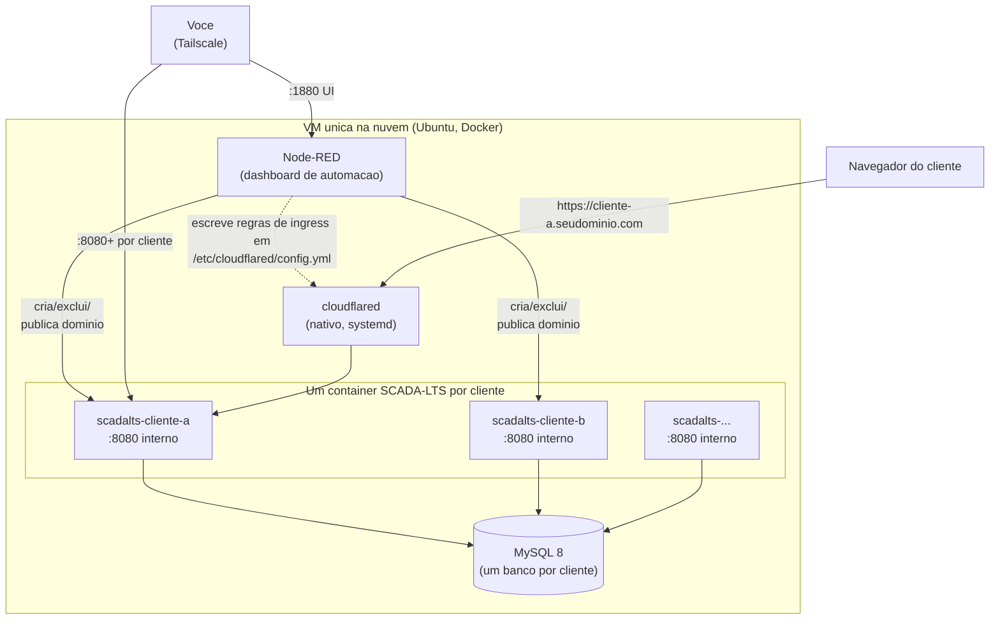

# Guia de Deploy — Supervisório SCADA-LTS multi-cliente (do zero)

*[Read in English](README.md)*

## Arquitetura



Nenhuma porta de aplicacao fica aberta pra internet publica — acesso e via
Tailscale (rede mesh privada, pra voce) ou via Cloudflare Tunnel (conexao
de saida da VM, pros clientes com dominio publico).

Passo a passo genérico pra alguém de fora replicar toda a infraestrutura:
criar a VM, abrir as portas certas, baixar/subir os serviços, e deixar a
automação de cliente novo funcionando. Sem nome de cliente real — troque
`<nome-do-cliente>` pelo que fizer sentido no seu caso.

Este é um guia standalone, direto ao ponto — sem histórico de bugs
ou decisões de arquitetura, só o caminho pra ter tudo rodando do zero.

## 1. O que você vai ter no final

- Uma VM Linux rodando **MySQL** (um banco por cliente) + **N
  instâncias de SCADA-LTS** (uma por cliente, cada uma seu próprio
  container Docker) + **Node-RED** (automação de criar/excluir cliente
  e publicar domínio).
- Cada cliente acessível por dois caminhos: um IP interno (Tailscale,
  pra você administrar) e opcionalmente um domínio público
  (`<cliente>.seudominio.com`, via Cloudflare Tunnel — sem porta
  aberta pra internet).
- Um formulário web (Node-RED Dashboard) onde você digita nome/cor/login
  do cliente e ele sobe tudo sozinho em 2-4 minutos.

## 2. Provisionar a VM

Qualquer provedor cloud serve; este projeto usa Hetzner Cloud (bom
custo-benefício, datacenter Europa/EUA).

- **Specs mínimas**: 2 vCPU, 4GB RAM pra poucos clientes (~3-5). Cada
  instância SCADA-LTS usa uns 350-500MB de RAM; planeje
  `500MB × número de clientes simultâneos + 1GB pro MySQL/Node-RED/SO`.
- **SO**: Ubuntu 24.04 LTS.
- Anote o IP público — vai precisar pra SSH e pro Cloudflare Tunnel.

## 3. Portas — o que precisa abrir de verdade

**Resposta curta: nenhuma porta de aplicação precisa ficar aberta pra
internet.** O acesso público é só via Cloudflare Tunnel (conexão de
saída da VM pro Cloudflare, não entrada).

| Porta | Serviço | Exposição |
|---|---|---|
| 22 | SSH | Só seu IP, ou melhor: só via Tailscale |
| 3306 | MySQL | Nunca exposta — só rede Docker interna |
| 8080+ (uma por cliente) | SCADA-LTS (Tomcat) | Só no IP Tailscale da VM (rede mesh privada) |
| 1880 | Node-RED (dashboard de automação) | Só no IP Tailscale da VM |
| — | Cloudflare Tunnel | Sem porta — conexão de saída (outbound) da VM pro Cloudflare |
| 6000-6100 (se usar ABS Cel) | Bridge Modbus do Gateway | Só rede Docker interna, entre Gateway e SCADA-LTS |

Instale o **Tailscale** na VM (`curl -fsSL https://tailscale.com/install.sh | sh`,
depois `tailscale up`) — é assim que você acessa tudo sem abrir porta
nenhuma pro mundo.

## 4. Instalar Docker

```bash
curl -fsSL https://get.docker.com | sh
sudo usermod -aG docker $USER
```

## 5. Subir o MySQL (banco compartilhado)

Cria `/opt/scadalts/stack/docker-compose.yml`:

```yaml
services:
  database:
    container_name: mysql
    image: mysql/mysql-server:8.0.32
    restart: unless-stopped
    environment:
      - MYSQL_ROOT_PASSWORD=<senha-forte-aqui>
      - MYSQL_USER=scadalts
      - MYSQL_PASSWORD=<senha-forte-aqui>
      - MYSQL_DATABASE=scadalts
    volumes:
      - ./db_data:/var/lib/mysql:rw
    command: --log_bin_trust_function_creators=1
```

```bash
cd /opt/scadalts/stack && docker compose up -d
```

## 6. Imagem do SCADA-LTS — qual baixar

**Não precisa baixar `.jar` manualmente** — a imagem Docker
`scadalts/scadalts` já vem com o SCADA-LTS (Tomcat + WAR) pronto.

```bash
docker pull scadalts/scadalts:v2.7.8.1
```

**Importante: fixe a versão, não use `:latest`.** No momento em que
este guia foi escrito, `:latest` resolve pra `v2.8.0`, que a própria
equipe do SCADA-LTS marca como **prerelease** no GitHub — não é a
versão estável recomendada pra produção. Confira a versão atual em
[github.com/SCADA-LTS/Scada-LTS/releases](https://github.com/SCADA-LTS/Scada-LTS/releases)
antes de fixar.

## 7. ABS Gateway/Master (só se usar modem ABS Cel)

**Isso é um padrão diferente de tudo que veio antes.** As seções 1-11
deste guia cobrem um padrão de "um cliente = um container SCADA-LTS
isolado + um banco" (padrão "formal": cada cliente totalmente separado,
porta própria, domínio próprio). ABS Gateway/Master cobre um segundo
padrão, distinto: **vários clientes compartilhando uma única instância de
SCADA-LTS**, cada um com um modem celular ABS Cel físico fazendo a ponte
Modbus, diferenciados só por permissão de usuário restrita (não por
containers/bancos separados). Não misture os dois — decida por cliente
qual padrão se aplica antes de provisionar.

Se o cliente tiver um modem celular ABS Cel, você precisa das imagens
proprietárias da ABS Telemetria (`abs-gateway`, `abs-master`) — peça
acesso ao registry deles, não são públicas. Sem modem ABS, pule esta
seção inteira (o cliente pode ter outro tipo de fonte de dado,
configurado como Data Source diferente dentro do próprio SCADA-LTS, no
padrão normal de container por cliente das seções 1-11).

**`docker-compose.yml`** (stack separado, ex.: `/opt/abs/docker-compose.yml`):

```yaml
services:
  abs_gateway:
    image: swr.abstelemetria.com/abs-gateway:v1.20
    container_name: abs_gateway
    command: -port=<PORTA_ABS_GATEWAY> -mport=<PORTA_ABS_GATEWAY>
    network_mode: "host"
    tty: true
    stdin_open: true
    restart: unless-stopped
    pids_limit: 65535
    ulimits:
      nproc: 65535

  master_main:
    image: swr.abstelemetria.com/abs-master:v6.02
    container_name: master_main
    network_mode: "host"
    tty: true
    stdin_open: true
    restart: unless-stopped
    volumes:
      - ./master_main/portas.txt:/opt/abs/portas.txt
      - ./master_main/master.txt:/opt/abs/master.txt
    pids_limit: 65535
    ulimits:
      nproc: 65535
```

**`master_main/master.txt`** — só um ID estático:
```
master_id = 1
#
```

**`master_main/portas.txt`** — mapeia porta TCP ↔ ID do modem, uma linha
por modem/cliente compartilhando esse mesmo Gateway/Master:
```
<PORTA_BRIDGE_1>=<ID_MODEM_1>
<PORTA_BRIDGE_2>=<ID_MODEM_2>
#
```

As duas imagens puxam de `swr.abstelemetria.com` — sem precisar de
`docker login` depois de ter acesso ao registry.

**Por que `network_mode: host`**: os dois containers precisam da porta do
modem ABS e das portas de bridge Modbus expostas direto nas interfaces de
rede da VM, não atrás da rede bridge do Docker — é assim que os modems
físicos (e o cliente Modbus do SCADA-LTS) conseguem alcançá-los.

**Onboarding de cliente novo na instância compartilhada** (esse é o
processo inteiro — ainda sem automação, diferente das seções 1-11):
1. Adiciona uma linha no `portas.txt`: `<porta-nova>=<id-do-modem>`.
2. Aplica: `docker compose restart master_main` (não precisa mexer no
   `abs_gateway`).
3. Dentro do SCADA-LTS compartilhado, cria um Data Source Modbus novo
   apontando pro IP do gateway da rede bridge do Docker (confere com
   `docker network inspect`, tipicamente algo como `172.18.0.1` — é o que
   um container dentro da rede do Docker enxerga como "o host") e a porta
   que você acabou de adicionar.
4. Cria um usuário read-only no SCADA-LTS, restrito só a esse Data Source
   (tela de Permissões) — é isso que de fato separa a visão de um cliente
   da do outro na instância compartilhada, já que todos logam na mesma URL.

**Configuração do Data Source no SCADA-LTS — valores que realmente
funcionam** (descobertos por tentativa e erro, o padrão não funciona):

| Campo | Valor | Por quê |
|---|---|---|
| Host | IP do gateway da rede bridge Docker (ex.: `172.18.0.1`) | Não é `localhost` — o container do SCADA-LTS precisa do endereço da bridge do lado do host |
| Porta | a porta de bridge escolhida no `portas.txt` | |
| Tipo de transporte | `TCP com manter-vivo` | |
| Timeout (ms) | `4500` | O padrão de 500ms falha com "sem resposta da rede" — o round-trip via 4G até o modem é bem mais lento que rede local |
| Retentativas | `3` | |
| Encapsulado | **marcado/true** | Crítico — força o modbus4j a montar o frame com cabeçalho MBAP completo, que é o formato que o master/datalogger ABS espera nesse canal |
| Id do escravo (leituras) | `1` | O `200` do manual ABS é só pra acesso serial direto, não se aplica via bridge TCP do Gateway |
| Offset | igual ao número real do registro do ponto | Apesar do rótulo na UI dizer "Offset (baseado em 0)", na prática **não é** base-0 nessa bridge — subtrair 1 quebra a leitura |

## 8. Cloudflare Tunnel

1. No painel Cloudflare Zero Trust, crie um túnel novo, anote o `tunnel
   id` e baixe o arquivo de credencial (`.json`).
2. Instale o `cloudflared` na VM:
   ```bash
   curl -L https://github.com/cloudflare/cloudflared/releases/latest/download/cloudflared-linux-amd64 -o /usr/bin/cloudflared
   chmod +x /usr/bin/cloudflared
   ```
3. `/etc/cloudflared/config.yml`:
   ```yaml
   tunnel: <seu-tunnel-id>
   credentials-file: /etc/cloudflared/<seu-tunnel-id>.json
   ingress:
     - service: http_status:404
   ```
4. Systemd service pra rodar sempre:
   ```bash
   cloudflared service install
   systemctl enable --now cloudflared
   ```

**Watcher de reload automático** — como cada cliente novo precisa de
uma linha nova em `ingress:`, e reiniciar o `cloudflared` manualmente
toda vez é chato/arriscado de esquecer, crie um watcher systemd que
reinicia sozinho quando o arquivo muda (arquivos prontos em
`systemd/cloudflared-reload.path` e `systemd/cloudflared-reload.service`
deste repo):

```bash
cp systemd/cloudflared-reload.* /etc/systemd/system/
systemctl daemon-reload
systemctl enable --now cloudflared-reload.path
```

## 9. Node-RED (automação de cliente novo)

```bash
mkdir -p /opt/node-red/data
```

`/opt/node-red/docker-compose.yml`:

```yaml
services:
  node-red:
    build: .
    image: node-red-com-docker
    container_name: node-red
    restart: unless-stopped
    user: root
    ports:
      - "<IP_TAILSCALE_DA_VM>:1880:1880"
    volumes:
      - ./data:/data
      - /var/run/docker.sock:/var/run/docker.sock
      - /opt/scadalts/stack:/opt/scadalts/stack
      - /etc/cloudflared/config.yml:/etc/cloudflared/config.yml
      - /opt/_backups_pre_reorg:/opt/_backups_pre_reorg
    networks:
      - default
      - scadalts_net
networks:
  default: {}
  scadalts_net:
    external: true
    name: stack_default
```

`Dockerfile` ao lado (a imagem base do Node-RED não vem com Docker CLI
nem PyYAML, e o fluxo de automação precisa dos dois):

```dockerfile
FROM nodered/node-red:latest
USER root
RUN apk add --no-cache docker-cli docker-cli-compose py3-yaml
USER node-red
```

```bash
cd /opt/node-red && docker compose up -d
```

Copie `node-red-flows/flows.json` deste repo pra
`/opt/node-red/data/flows.json` — é a automação **completa e real**,
não uma descrição, importe direto: formulário de criar cliente (nome,
paleta de 12 cores, login/senha com confirmação), barra de progresso
ao vivo, botão "Publicar domínio", botão "Excluir" com senha mestra +
backup automático, trava impedindo duas operações pesadas ao mesmo
tempo. Antes de subir, troque os placeholders no arquivo:

| Placeholder | O que é |
|---|---|
| `__CF_API_TOKEN__` | Token da API Cloudflare (ver abaixo) |
| `__CF_ZONE_ID__` | ID da zona/domínio no Cloudflare (Painel → seu domínio → barra lateral direita) |
| `__CF_TUNNEL_ID__` | ID do túnel criado no passo 8 |
| `__TAILSCALE_IP_DA_VM__` | IP Tailscale da sua VM |
| `__SEU_DOMINIO__` | Seu domínio (ex.: `exemplo.com`) |
| `__MYSQL_ROOT_PASSWORD__` | Senha do MySQL definida no passo 5 |
| `__MASTER_PASSWORD_EXCLUIR__` | Senha que você escolher pra confirmar exclusão de cliente |

Copie também `node-red-flows/novo_cliente.py` deste repo pra
`/opt/scadalts/stack/scripts/novo_cliente.py` — é o script que o fluxo chama
pra criar banco/container. **Este arquivo precisa de dois placeholders
trocados, não só um**: `__TAILSCALE_IP_DA_VM__` *e* `__MYSQL_ROOT_PASSWORD__`
(ele roda `mysql -u root -p...` direto). Esquecer o segundo dá
`ERROR 1045 (28000): Access denied for user 'root'@'localhost'` na primeira
tentativa de criar cliente.

Por fim, copie os templates de marca de `node-red-flows/templates/` (ver
seção 10 abaixo) pra `/opt/scadalts/stack/_template/` — o `novo_cliente.py`
espera esses arquivos lá e falha se a pasta não existir:

```bash
mkdir -p /opt/scadalts/stack/_template
cp node-red-flows/templates/* /opt/scadalts/stack/_template/
```

A imagem base `nodered/node-red` **não** vem com a UI do dashboard nem com
o nó de MySQL — o `flows.json` precisa dos dois. Instale antes de reiniciar:

```bash
docker exec node-red sh -c 'cd /data && npm install node-red-dashboard node-red-node-mysql'
```

Reinicie o container do Node-RED depois de colocar todos os arquivos acima
e instalar esses dois pacotes.

**Token Cloudflare pro botão "Publicar domínio"**: crie em
[dash.cloudflare.com/profile/api-tokens](https://dash.cloudflare.com/profile/api-tokens),
permissões `Zone → DNS → Edit` + `Account → Cloudflare Tunnel → Edit`,
escopo só na sua zona/domínio.

## 9b. Como fica o serviço de um cliente no `docker-compose.yml`

O `novo_cliente.py` adiciona automaticamente um bloco assim (exemplo
real, gerado pelo script) — é isso que junta banco, container, tema e
domínio numa coisa só:

```yaml
services:
  scadalts-<nome>:
    image: scadalts/scadalts:v2.7.8.1
    restart: unless-stopped
    environment:
      - CATALINA_OPTS=-Xmx384m -Xms192m
      - TZ=America/Sao_Paulo
    ports:
      - <IP_TAILSCALE_DA_VM>:<porta>:8080
    depends_on:
      - database
    volumes:
      - ./clients/<nome>/tomcat_log:/usr/local/tomcat/logs:rw
      - ./clients/<nome>/context.xml:/usr/local/tomcat/webapps/Scada-LTS/META-INF/context.xml:ro
      - ./clients/<nome>/env.properties:/usr/local/tomcat/webapps/Scada-LTS/WEB-INF/classes/env.properties:ro
      - ./clients/<nome>/graphics:/usr/local/tomcat/webapps/Scada-LTS/graphics:rw
      - ./clients/<nome>/login/login-theme.css:/usr/local/tomcat/webapps/Scada-LTS/assets/login-theme.css:ro
      - ./clients/<nome>/login/<nome>-logo.png:/usr/local/tomcat/webapps/Scada-LTS/assets/<nome>-logo.png:ro
      - ./clients/<nome>/login/login.jsp:/usr/local/tomcat/webapps/Scada-LTS/WEB-INF/jsp/login.jsp:ro
    links:
      - database:database
    command:
      - /usr/bin/wait-for-it
      - --host=database
      - --port=3306
      - --timeout=60
      - --strict
      - --
      - /usr/local/tomcat/bin/catalina.sh
      - run
```

`Xmx384m` é pouco de propósito — cada instância SCADA-LTS não precisa
de muita RAM sozinha; ajuste conforme o volume de dados/telas gráficas
do cliente. `wait-for-it` garante que o Tomcat só tenta subir depois do
MySQL estar de pé (evita erro de conexão no primeiro boot).

## 10. A página de login e a home bonitas (branding por cliente)

O SCADA-LTS puro tem uma tela de login e um "watch list" genéricos, sem
identidade visual — pra cada cliente ter sua cor/logo, o
`novo_cliente.py` (passo 9) troca 4 arquivos dentro do container antes
de subir, usando os templates deste repo em `node-red-flows/templates/`:

| Arquivo | Serve pra | Placeholders | Onde fica dentro do container |
|---|---|---|---|
| `login.jsp` | Substitui a tela de login padrão do SCADA-LTS | `{{CLIENTE_NOME}}`, `{{LOGO_FILENAME}}` | `WEB-INF/jsp/login.jsp` (bind mount `:ro`) |
| `login-theme.css` | Cor do tema aplicada na tela de login | `{{CLIENTE_NOME}}`, `{{COR_TEMA}}`, `{{COR_TEMA_HOVER}}` | `assets/login-theme.css` (bind mount `:ro`) |
| `home.html` | Página inicial personalizada que o cliente vê ao logar (em vez do "watch list" técnico padrão) | `{{CLIENTE_NOME}}`, `{{COR_TEMA}}`, `{{LOGO_FILENAME}}` | dentro da pasta `graphics/`, que é montada inteira (`graphics:rw`) — é lá que o login do cliente aponta (`homeUrl: /graphics/home.html`) |
| `context.xml` | Aponta o Tomcat pro banco MySQL certo desse cliente | `{{NOME_CLIENTE}}`, `{{DB_SENHA}}` | `META-INF/context.xml` (bind mount `:ro`) |
| `env.properties` | Config padrão do SCADA-LTS (sem placeholder, copiado igual pra todo cliente) | — | `WEB-INF/classes/env.properties` (bind mount `:ro`) |

**Como a substituição funciona**: o script lê cada template, troca
`{{PLACEHOLDER}}` pelo valor real (nome do cliente, hex da cor escolhida
no formulário, nome do arquivo de logo), escreve o resultado em
`/opt/scadalts/stack/clients/<nome>/`, e o serviço gerado no
`docker-compose.yml` (seção 9) monta cada arquivo **por cima** do
arquivo padrão do SCADA-LTS dentro da imagem via `volumes:` — um mount
por arquivo, mais um mount de pasta inteira (`graphics/`) pra
`home.html` + o logo.

Pra trocar o **logo**: coloque o PNG do cliente em
`/opt/scadalts/stack/clients/<nome>/graphics/<nome>-logo-full.png`
(usado no `home.html`) e `/opt/scadalts/stack/clients/<nome>/login/<nome>-logo.png`
(usado no `login.jsp`) — o `novo_cliente.py` já sabe montar esses
caminhos, só precisa os arquivos existirem antes do container subir.

## 11. Criar o primeiro cliente

Com tudo no ar: abra o dashboard Node-RED, aba "Cliente Novo", preencha
nome/cor/login, clique em Criar. Acompanhe a barra de progresso (leva
uns 2-4 minutos, a maior parte é o Tomcat subindo). No fim, o cliente
aparece na aba "Clientes Ativos" com link de acesso — daí é só clicar
em "Publicar domínio" se quiser um link público.

## Resumo dos "arquivos a baixar"

| O quê | De onde | Precisa de conta/token? |
|---|---|---|
| Imagem SCADA-LTS | `docker pull scadalts/scadalts:v2.7.8.1` | Não |
| Imagem MySQL | `docker pull mysql/mysql-server:8.0.32` | Não |
| `cloudflared` | GitHub releases da Cloudflare | Não (mas precisa de conta Cloudflare pra criar o túnel) |
| Imagens ABS Gateway/Master | Registry privado da ABS Telemetria | Sim, só se usar modem ABS Cel |
| Templates de login/tema (JSP + CSS) | Vem junto com o próprio SCADA-LTS, customize a partir do padrão dele | Não |

## Lacunas conhecidas (honesto, sem esconder)

- **Ainda não validado ponta a ponta numa VM nova** por uma execução
  independente deste guia exato — reflete um deploy real e funcionando, mas
  o guia em si ainda não foi testado do zero numa VM em branco.
- **Sem backup automático dos bancos de cliente ainda** — só o fluxo de
  "Excluir" faz backup de um banco específico, bem antes de remover.
  Não existe backup periódico dos bancos que continuam rodando.
- **Sem CI/testes** — isso é documentação + templates de config, não um
  código testado automaticamente.

## Licença

MIT — ver [`LICENSE`](LICENSE). O próprio SCADA-LTS e qualquer componente
de terceiro (ABS Gateway/Master, Cloudflare) mantêm suas licenças próprias.
