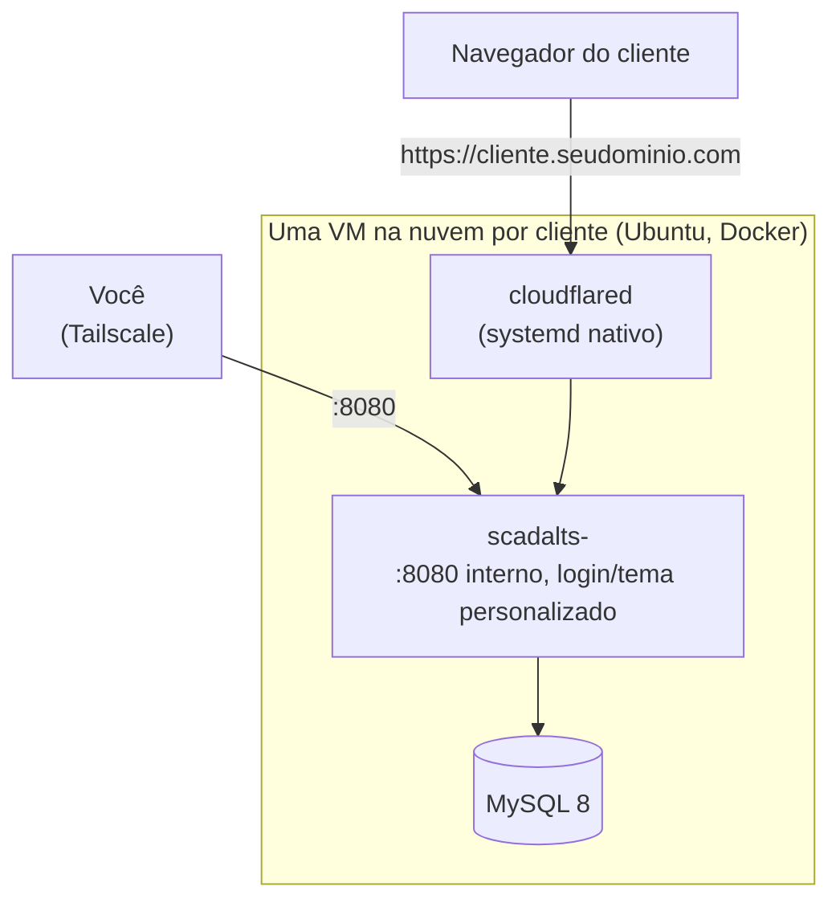

# I.O Guia de Deploy SCADA-LTS

*[Read in English](README.md)*

Passo a passo do zero pra fazer deploy de uma **instância SCADA-LTS
personalizada pra um cliente numa VM na nuvem**: Docker, MySQL, o
container do SCADA-LTS em si, ponte opcional com modem físico, tema/logo
personalizado pra esse cliente, e domínio público via Cloudflare Tunnel —
sem nenhuma porta aberta pra internet.

Sem nome de cliente real, IP ou segredo em lugar nenhum deste repo — todo
valor que precisa ser real é um `<placeholder>` ou `__VAR_AMBIENTE__`.

## Arquitetura



Nenhuma porta de entrada é aberta pra internet pública pra aplicação em
si — o acesso é sempre via Tailscale (rede mesh privada, pra você) ou via
Cloudflare Tunnel (conexão de saída da VM, pro domínio público do
cliente).

**Por que uma VM por cliente, não uma VM compartilhada pra todo mundo**:
isolamento total. Se a VM de um cliente tiver problema, nenhum outro
cliente é afetado — sem banco compartilhado, sem runtime de container
compartilhado, sem raio de explosão. Também significa que o custo de cada
VM mapeia direto pra fatura de um cliente.

## 1. O que você vai ter no final

- Uma VM Linux rodando **MySQL** + **uma instância SCADA-LTS**,
  personalizada com nome/cor/logo desse cliente.
- O cliente acessível de dois jeitos: um IP interno (Tailscale, pra você
  administrar) e um domínio público (`<cliente>.seudominio.com`, via
  Cloudflare Tunnel — sem porta aberta).
- Opcionalmente, uma ponte Modbus física (seção 7) se o cliente tiver um
  modem celular ABS Cel em vez de outro tipo de fonte de dado.

## 2. Provisionar a VM

Qualquer provedor cloud serve; este projeto usa Hetzner Cloud (bom
custo-benefício, datacenter Europa/EUA).

- **Specs mínimas**: 2 vCPU, 4GB RAM — uma instância SCADA-LTS usa uns
  350-500MB de RAM, o resto é MySQL/SO/folga.
- **SO**: Ubuntu 24.04 LTS.
- **Custo**: uma VM classe `cx23` da Hetzner (2 vCPU/4GB) fica em torno de
  €6-7/mês no momento em que isso foi escrito — confira o preço atual,
  isso muda.
- Anote o IP público — vai precisar pra SSH e pro Cloudflare Tunnel.

## 3. Portas — o que precisa abrir de verdade

**Resposta curta: nenhuma porta de aplicação precisa ficar aberta pra
internet.** O acesso público é só via Cloudflare Tunnel (conexão de
saída da VM, não entrada).

| Porta | Serviço | Exposição |
|---|---|---|
| 22 | SSH | Só seu IP, ou melhor: só via Tailscale |
| 3306 | MySQL | Nunca exposta — só rede Docker interna |
| 8080 | SCADA-LTS (Tomcat) | Só no IP Tailscale da VM (rede mesh privada) |
| — | Cloudflare Tunnel | Sem porta — conexão de saída da VM pro Cloudflare |
| 6000+ (se usar modem ABS Cel) | Bridge Modbus do Gateway | Só rede Docker interna, entre Gateway e SCADA-LTS |

Instale o **Tailscale** na VM (`curl -fsSL https://tailscale.com/install.sh | sh`,
depois `tailscale up`) — é assim que você acessa sem abrir porta nenhuma
pro mundo.

## 4. Instalar Docker

```bash
curl -fsSL https://get.docker.com | sh
sudo usermod -aG docker $USER
```

## 5. Subir o MySQL

Cria `/opt/scadalts/stack/docker-compose.yml`:

```yaml
services:
  database:
    container_name: mysql
    image: mysql/mysql-server:8.0.32
    restart: unless-stopped
    environment:
      - MYSQL_ROOT_PASSWORD=<senha-forte-aqui>
      - MYSQL_USER=scadalts
      - MYSQL_PASSWORD=<senha-forte-aqui>
      - MYSQL_DATABASE=scadalts
    volumes:
      - ./db_data:/var/lib/mysql:rw
    command: --log_bin_trust_function_creators=1
```

```bash
cd /opt/scadalts/stack && docker compose up -d
```

## 6. Imagem do SCADA-LTS — qual baixar

**Não precisa baixar `.jar` manualmente** — a imagem Docker
`scadalts/scadalts` já vem com o SCADA-LTS (Tomcat + WAR) pronto.

```bash
docker pull scadalts/scadalts:v2.7.8.1
```

**Importante: fixe a versão, não use `:latest`.** No momento em que este
guia foi escrito, `:latest` resolve pra `v2.8.0`, que a própria equipe do
SCADA-LTS marca como **prerelease** no GitHub — não é a versão estável
recomendada pra produção. Confira a versão atual em
[github.com/SCADA-LTS/Scada-LTS/releases](https://github.com/SCADA-LTS/Scada-LTS/releases)
antes de fixar.

## 7. ABS Gateway/Master (só se o cliente tiver modem ABS Cel)

Se o cliente tiver um modem celular ABS Cel fazendo a ponte Modbus, você
precisa das imagens proprietárias da ABS Telemetria (`abs-gateway`,
`abs-master`) — peça acesso ao registry deles, não são públicas. Sem
modem ABS, pule esta seção inteira (o cliente pode ter outro tipo de
fonte de dado, configurado como Data Source dentro do próprio
SCADA-LTS).

**`docker-compose.yml`** (stack separado, ex.: `/opt/abs/docker-compose.yml`):

```yaml
services:
  abs_gateway:
    image: swr.abstelemetria.com/abs-gateway:v1.20
    container_name: abs_gateway
    command: -port=<PORTA_ABS_GATEWAY> -mport=<PORTA_ABS_GATEWAY>
    network_mode: "host"
    tty: true
    stdin_open: true
    restart: unless-stopped
    pids_limit: 65535
    ulimits:
      nproc: 65535

  master_main:
    image: swr.abstelemetria.com/abs-master:v6.02
    container_name: master_main
    network_mode: "host"
    tty: true
    stdin_open: true
    restart: unless-stopped
    volumes:
      - ./master_main/portas.txt:/opt/abs/portas.txt
      - ./master_main/master.txt:/opt/abs/master.txt
    pids_limit: 65535
    ulimits:
      nproc: 65535
```

**`master_main/master.txt`** — só um ID estático:
```
master_id = 1
#
```

**`master_main/portas.txt`** — mapeia porta TCP ↔ ID do modem. Numa VM de
um-cliente-só, esse arquivo sempre tem uma linha só (o modem desse
cliente), já que não tem mais ninguém dividindo o Gateway:
```
<PORTA_BRIDGE>=<ID_MODEM>
#
```

As duas imagens puxam de `swr.abstelemetria.com` — sem precisar de
`docker login` depois de ter acesso ao registry.

**Por que `network_mode: host`**: os dois containers precisam da porta do
modem ABS e da porta de bridge Modbus expostas direto nas interfaces de
rede da VM, não atrás da rede bridge do Docker — é assim que o modem
físico (e o cliente Modbus do SCADA-LTS) conseguem alcançá-los.

**Configuração do Data Source no SCADA-LTS — valores que realmente
funcionam** (descobertos por tentativa e erro, o padrão não funciona):

| Campo | Valor | Por quê |
|---|---|---|
| Host | IP do gateway da rede bridge Docker (ex.: `172.18.0.1`, confere com `docker network inspect`) | Não é `localhost` — o container do SCADA-LTS precisa do endereço da bridge do lado do host |
| Porta | a porta de bridge do `portas.txt` | |
| Tipo de transporte | `TCP com manter-vivo` | |
| Timeout (ms) | `4500` | O padrão de 500ms falha com "sem resposta da rede" — o round-trip via 4G até o modem é bem mais lento que rede local |
| Retentativas | `3` | |
| Encapsulado | **marcado/true** | Crítico — força o modbus4j a montar o frame com cabeçalho MBAP completo, que é o formato que o master/datalogger ABS espera nesse canal |
| Id do escravo (leituras) | `1` | O `200` do manual ABS é só pra acesso serial direto, não se aplica via bridge TCP do Gateway |
| Offset | igual ao número real do registro do ponto | Apesar do rótulo na UI dizer "Offset (baseado em 0)", na prática **não é** base-0 nessa bridge — subtrair 1 quebra a leitura |

## 8. Cloudflare Tunnel

1. No painel Cloudflare Zero Trust, crie um túnel novo, anote o `tunnel
   id`, e baixe o arquivo de credencial (`.json`).
2. Instale o `cloudflared` na VM:
   ```bash
   curl -L https://github.com/cloudflare/cloudflared/releases/latest/download/cloudflared-linux-amd64 -o /usr/bin/cloudflared
   chmod +x /usr/bin/cloudflared
   ```
3. `/etc/cloudflared/config.yml`:
   ```yaml
   tunnel: <seu-tunnel-id>
   credentials-file: /etc/cloudflared/<seu-tunnel-id>.json
   ingress:
     - hostname: <cliente>.seudominio.com
       service: http://<VM_TAILSCALE_IP>:8080
     - service: http_status:404
   ```
4. Systemd service pra rodar sempre:
   ```bash
   cloudflared service install
   systemctl enable --now cloudflared
   ```

Uma VM, um cliente, uma regra de `ingress` — sem precisar de
watcher/automação aqui, você escreve o arquivo uma vez quando prepara a
VM.

### 8.1 — Configuração da zona (fazer UMA VEZ por domínio, não por cliente)

O SCADA-LTS fica em `/Scada-LTS/`, não na raiz do domínio — então
`https://<cliente>.seudominio.com/` (sem caminho) dá 404 direto do
Tomcat, o que parece uma queda pra quem só digita o domínio puro.
Resolve isso uma vez, no nível da zona Cloudflare, e todo subdomínio de
cliente que você criar depois já vem coberto — sem configuração por
cliente.

**1. Redirecionar raiz → `/Scada-LTS/`** (dashboard Cloudflare → sua zona
→ Rules → Redirect Rules → Create rule, ou via API):
- Quando a requisição bater com: `(http.host contains ".seudominio.com" and http.request.uri.path eq "/")`
- Então: Redirect dinâmico, status `302`, URL de destino (expressão
  dinâmica): `concat("https://", http.host, "/Scada-LTS/")`

Usar `http.host` no destino (em vez de fixar o hostname de um cliente
só) é o que faz isso valer pra qualquer subdomínio, presente e futuro.

**2. Ligar "Always Use HTTPS"** (zona → SSL/TLS → Edge Certificates →
Always Use HTTPS). O próprio SCADA-LTS não sabe que está atrás de um
túnel que termina TLS, então os redirects internos dele (ex:
`/Scada-LTS/` → `/Scada-LTS/login.htm`) saem como `http://`, não
`https://`. Sem essa opção, isso é um salto inseguro/mixed-content que o
navegador pode avisar. Com ela ligada, a borda da Cloudflare reescreve
qualquer salto `http://` da sua zona de volta pra `https://` antes de
chegar no navegador — resolve pra todo cliente sem mexer na config do
Tomcat.

Descoberto na prática em 2026-08-26: um subdomínio de cliente novo
(`centrooperacional.uk`) parecia "fora do ar" — era só o 404 da raiz,
não uma queda real. As duas configurações acima são de nível de zona,
então foram feitas uma vez só e todo hostname de cliente adicionado
depois já herda elas.

## 9. Criar o cliente — tema + subir

O SCADA-LTS de fábrica tem uma tela de login genérica e uma home técnica
de "lista de observação". Pra dar nome/cor/logo próprios pro cliente, você
troca 4 arquivos dentro do container **antes** de subir, usando os
templates da pasta `templates/` deste repo.

**Convenção de dois logos (fornecedor vs. cliente) — padrão pra todo
deploy.** Esse modelo é um serviço gerenciado: **você** (o fornecedor/
revendedor que roda essa VM pro cliente) e **o cliente** (que usa o
sistema no dia a dia) são partes diferentes, e a marca reflete isso em
3 lugares:

| Tela | Logo mostrado | Por quê |
|---|---|---|
| Tela de login | **Fornecedor** (você) | O login é a porta de entrada pro *seu* serviço — o cliente vê quem tá rodando antes mesmo de entrar. |
| Topo do dashboard (superior esquerdo, clicável) | **Cliente** | Depois de logado, é a visão operacional do cliente — a marca dele, linkando pro site dele. |
| Rodapé do dashboard (inferior esquerdo, clicável) | **Fornecedor** (você) | Crédito discreto tipo "powered by", linkando pro seu site — não compete com a marca do cliente lá em cima. |

Inverter isso (ex: logo do fornecedor no topo) passa a impressão de que
o sistema do cliente foi rotulado como *seu* produto, em vez de um
serviço que *você* presta *pra ele* — confunde o cliente e vale acertar
já na primeira renderização.

**9.1 — Renderiza os templates.** Escolhe o nome do cliente (minúsculo,
sem espaço/acento — vira o nome do banco), uma cor de tema, uma senha de
banco, e o logo/link do próprio cliente. Os valores do fornecedor (você)
são os mesmos pra todo cliente que você atender — define uma vez e
reusa.

```bash
NOME=<nome-do-cliente>       # ex: acme
COR=<#cor-hex>                 # ex: #1b5c94
COR_HOVER=<#cor-hex, um pouco mais escura/clara que COR>  # usada no hover do botão
DB_SENHA=<senha-forte>
CLIENTE_LINK=<https://site-do-cliente.example>   # logo do topo linka pra ca

PROVEDOR_NOME=<nome-da-sua-empresa>               # igual pra todo cliente
PROVEDOR_LOGO_FILENAME=provedor-logo.png          # mesmo arquivo pra todo cliente
PROVEDOR_LINK=<https://seu-site.example>          # igual pra todo cliente

mkdir -p /opt/scadalts/stack/clients/$NOME/login \
         /opt/scadalts/stack/clients/$NOME/graphics \
         /opt/scadalts/stack/clients/$NOME/tomcat_log

cd templates   # pasta templates/ deste repo

sed "s/{{NOME_CLIENTE}}/$NOME/g; s/{{DB_SENHA}}/$DB_SENHA/g" \
  context.xml > /opt/scadalts/stack/clients/$NOME/context.xml

cp env.properties /opt/scadalts/stack/clients/$NOME/env.properties

sed "s/{{CLIENTE_NOME}}/$NOME/g; s/{{COR_TEMA}}/$COR/g; s/{{COR_TEMA_HOVER}}/$COR_HOVER/g; s/{{LOGO_FILENAME}}/${NOME}-logo.png/g" \
  login-theme.css > /opt/scadalts/stack/clients/$NOME/login/login-theme.css

sed "s/{{PROVEDOR_NOME}}/$PROVEDOR_NOME/g; s/{{PROVEDOR_LOGO_FILENAME}}/$PROVEDOR_LOGO_FILENAME/g" \
  login.jsp > /opt/scadalts/stack/clients/$NOME/login/login.jsp

sed "s/{{CLIENTE_NOME}}/$NOME/g; s/{{CLIENTE_LINK}}/$CLIENTE_LINK/g; s/{{COR_TEMA}}/$COR/g; s/{{COR_TEMA_HOVER}}/$COR_HOVER/g; s/{{LOGO_FILENAME}}/${NOME}-logo.png/g; s/{{PROVEDOR_NOME}}/$PROVEDOR_NOME/g; s/{{PROVEDOR_LOGO_FILENAME}}/$PROVEDOR_LOGO_FILENAME/g; s|{{PROVEDOR_LINK}}|$PROVEDOR_LINK|g" \
  home.html > /opt/scadalts/stack/clients/$NOME/graphics/home.html

cp -r vendor /opt/scadalts/stack/clients/$NOME/graphics/vendor
cp $NOME-logo.png /opt/scadalts/stack/clients/$NOME/graphics/${NOME}-logo.png 2>/dev/null || true
cp $PROVEDOR_LOGO_FILENAME /opt/scadalts/stack/clients/$NOME/graphics/$PROVEDOR_LOGO_FILENAME 2>/dev/null || true
```

**Aviso de cache:** navegadores (e Cloudflare, se estiver na frente)
cacheiam essas imagens de logo com força — o Tomcat serve arquivo
estático com `max-age` longo por padrão. Se um dia trocar o arquivo de
logo com o cliente já no ar, sobe o `?v=1` do template (`?v=2`, `?v=3`,
...) e limpa qualquer cache de CDN — só recarregar/hard-refresh nem
sempre resolve. Descoberto em 2026-08-26 depurando exatamente isso: o
lado do servidor já estava certo, a imagem velha era 100% cache do
cliente/borda.

`home.html` é o **dashboard completo** (não é placeholder): barra
superior com menu (Início/Mapa/Histórico/Alarmes), cards de telemetria
ao vivo por Data Source, mapa Leaflet, gráfico de histórico com
exportação Excel, e lista paginada de alarmes. Ele lê tudo direto da API
REST do próprio SCADA-LTS (`/api/datapoint/getAll` e afins) — você não
edita esse arquivo de novo quando os Data Sources/Points de um cliente
mudam, ele detecta sozinho. O `vendor/` (~1.5MB: Leaflet, Chart.js,
Flatpickr, SheetJS) precisa ser copiado junto porque o CSP abaixo
bloqueia carregar isso de CDN — precisa vir da mesma origem.

Coloca o logo real do cliente (PNG) em
`/opt/scadalts/stack/clients/$NOME/login/$NOME-logo.png` — é o arquivo que
`login.jsp` e `home.html` referenciam.

**Faz isso antes do passo 9.3 (`docker compose up`), mesmo sem ter o
logo real ainda.** O bloco do compose abaixo monta esse caminho exato
como bind mount dentro do container. Se o arquivo não existir na hora
que o container é criado, o Docker cria uma **pasta** ali em silêncio,
em vez de dar erro — e colocar o PNG real depois não resolve (o
container já tem uma pasta montada, não um arquivo). Se ainda não tiver
o logo pronto, cria um placeholder vazio primeiro pra ter um arquivo de
verdade pro bind mount grudar:

```bash
touch /opt/scadalts/stack/clients/$NOME/login/$NOME-logo.png
```

Troca pelo PNG real depois, e recria o container
(`docker compose up -d --force-recreate scadalts-$NOME`) — um
`docker restart` simples não basta, precisa recriar pro bind mount
reavaliar o arquivo.

| Arquivo | Finalidade | Onde cai no container |
|---|---|---|
| `login.jsp` | Substitui a tela de login padrão | `WEB-INF/jsp/login.jsp` (bind mount `:ro`) |
| `login-theme.css` | Cor do tema na tela de login | `assets/login-theme.css` (bind mount `:ro`) |
| `home.html` | Dashboard completo depois do login (menu, telemetria, mapa, histórico, alarmes) em vez da "lista de observação" técnica padrão | dentro de `graphics/`, montado inteiro — vira o Home URL do usuário (passo 9.5) |
| `vendor/` | Bibliotecas JS/CSS que o `home.html` precisa (Leaflet, Chart.js, Flatpickr, SheetJS) | dentro de `graphics/vendor/`, mesmo mount acima |
| `context.xml` | Aponta o Tomcat pro banco MySQL desse cliente | `META-INF/context.xml` (bind mount `:ro`) |
| `env.properties` | Config padrão do SCADA-LTS, sem placeholder, copiado igual pra todo cliente | `WEB-INF/classes/env.properties` (bind mount `:ro`) |

**9.2 — Cria o banco.**

> **Por que `IDENTIFIED WITH mysql_native_password`, não o padrão**:
> o MySQL 8 usa `caching_sha2_password` por padrão pra usuário novo, mas o
> driver JDBC dentro da imagem do SCADA-LTS é uma versão antiga
> (`mysql-connector-java 5.1.49`), que não fala esse protocolo direito —
> resultado: `Access denied` mesmo com senha certa, `500 System exception!`
> na tela de login. Descoberto testando o processo do zero numa VM
> descartável em 2026-08-22.

```bash
docker exec mysql mysql -u root -p<senha-root-mysql> -e \
  "CREATE DATABASE IF NOT EXISTS scadalts_$NOME;
   CREATE USER IF NOT EXISTS 'scadalts_$NOME'@'%' IDENTIFIED WITH mysql_native_password BY '$DB_SENHA';
   GRANT ALL PRIVILEGES ON scadalts_$NOME.* TO 'scadalts_$NOME'@'%';
   FLUSH PRIVILEGES;"
```

**9.3 — Adiciona o serviço no `docker-compose.yml`.** Anexa este bloco
(não reescreva o arquivo inteiro via `yaml.dump` se estiver programando
isso — veja o porquê abaixo):

```yaml
  scadalts-<nome>:
    image: scadalts/scadalts:v2.7.8.1
    restart: unless-stopped
    environment:
      - CATALINA_OPTS=-Xmx384m -Xms192m
      - TZ=America/Sao_Paulo
    ports:
      - <VM_TAILSCALE_IP>:8080:8080
    depends_on:
      - database
    volumes:
      - ./clients/<nome>/tomcat_log:/usr/local/tomcat/logs:rw
      - ./clients/<nome>/context.xml:/usr/local/tomcat/webapps/Scada-LTS/META-INF/context.xml:ro
      - ./clients/<nome>/env.properties:/usr/local/tomcat/webapps/Scada-LTS/WEB-INF/classes/env.properties:ro
      - ./clients/<nome>/graphics:/usr/local/tomcat/webapps/Scada-LTS/graphics:rw
      - ./clients/<nome>/login/login-theme.css:/usr/local/tomcat/webapps/Scada-LTS/assets/login-theme.css:ro
      - ./clients/<nome>/login/<nome>-logo.png:/usr/local/tomcat/webapps/Scada-LTS/assets/<nome>-logo.png:ro
      - ./clients/<nome>/login/login.jsp:/usr/local/tomcat/webapps/Scada-LTS/WEB-INF/jsp/login.jsp:ro
    links:
      - database:database
    command:
      - /usr/bin/wait-for-it
      - --host=database
      - --port=3306
      - --timeout=60
      - --strict
      - --
      - /usr/local/tomcat/bin/catalina.sh
      - run
```

`Xmx384m` é deliberadamente modesto — uma instância SCADA-LTS sozinha não
precisa de muita RAM; ajuste pro volume real de dado/gráfico do cliente.
`wait-for-it` garante que o Tomcat só tenta subir depois do MySQL estar
de pé (evita erro de conexão no primeiro boot).

> **Por que anexar em vez de reescrever o arquivo inteiro**: fazer parse
> do `docker-compose.yml` inteiro com uma lib de YAML e regravar reformata
> o arquivo todo — e o Docker Compose calcula um hash de config por
> serviço a partir do conteúdo atual do arquivo. Mesmo uma mudança de
> formatação sem relação nenhuma pode fazer ele achar que o `database`
> (MySQL) também mudou, e **recriar ele sem avisar** na próxima vez que
> você roda `docker compose up` — bem na hora que o cliente novo tenta
> conectar no banco pela primeira vez. Descoberto na marra; só anexar (ou
> uma edição cirúrgica em texto que toca só o bloco desse cliente) evita
> isso por completo.

```bash
cd /opt/scadalts/stack && docker compose up -d scadalts-$NOME
```

**9.4 — Espera subir, depois confere.**

```bash
until curl -s -o /dev/null -w '%{http_code}' http://<VM_TAILSCALE_IP>:8080/Scada-LTS/login.htm | grep -q 200; do
  sleep 3
done
echo "no ar"
```

Abre `http://<ip-tailscale-da-vm>:8080/Scada-LTS/login.htm` — deve
aparecer a tela de login personalizada (nome do cliente, cor escolhida).
Loga com o admin padrão do SCADA-LTS, cria os usuários reais do cliente
por lá.

**9.5 — Faz cada usuário cair na home personalizada, não na watch list
padrão.** Sem esse passo, logar mostra a tela nativa "watch list" do
SCADA-LTS, não o `home.html` que você personalizou no passo 9.1 — esse
campo é por usuário e nada acima o configura sozinho.

Pra cada usuário (incluindo o `admin`, ou a conta que o cliente vai usar
de verdade): campo `Users → <usuário> → Home URL`, definido como:

```
graphics/home.html
```

**Isso não é um passo único — repita pra todo usuário novo que você
criar daqui pra frente.** O próprio formulário de "Adicionar Usuário" do
SCADA-LTS pré-preenche esse campo com `graphics/home.htm` (faltando o
"l") como sugestão/exemplo — se não for apagado e digitado de novo, salva
desse jeito e o redirect pós-login desse usuário dá 404. Descoberto em
2026-08-26: um usuário de cliente criado depois da configuração inicial
caiu em 404 por causa exatamente desse padrão. Sempre confere se esse
campo está `graphics/home.html` (com o "l") depois de criar qualquer
usuário, não só na configuração inicial.

**Precisa ser exatamente assim — caminho relativo, sem barra no início,
sem domínio.** Um valor como `/graphics/home.html` ou uma URL completa
quebra o redirect pós-login (dá 404 num caminho `/S/...` bagunçado) —
não é risco de digitação, é assim que o próprio `parseHomeUrl()` do
SCADA-LTS só tira barra do **início**, então um valor que já não vem
relativo continua quebrado. Salva, desloga, loga de novo pra confirmar
que caiu na home personalizada.

## Resumo do "que baixar"

| O quê | De onde | Precisa de conta/token? |
|---|---|---|
| Imagem SCADA-LTS | `docker pull scadalts/scadalts:v2.7.8.1` | Não |
| Imagem MySQL | `docker pull mysql/mysql-server:8.0.32` | Não |
| `cloudflared` | GitHub releases da Cloudflare | Não (mas precisa de conta Cloudflare pra criar o túnel) |
| Imagens ABS Gateway/Master | Registry privado da ABS Telemetria | Sim, só se usar modem ABS Cel |
| Templates de marca (`templates/`) | Este repo | Não |

## Bugs encontrados em produção (2026-08-27) — corrigidos, registrados aqui pra não repetir

**Barra de navegação secundária não escondia na tela de login.** O tema
de login (`templates/login-theme.css`) já escondia `#mainHeader`, mas o
SCADA-LTS renderiza um **segundo** elemento de navegação, `#subHeader`
(`class="navHeader"`) — barra com ícone de play e troca de idioma — que
não estava coberto. Sem esconder os dois, sobra uma faixa quebrada no
topo da tela de login (visível principalmente quando o tema custom muda
o fundo pra escuro, já que o `#subHeader` sem estilo próprio fica com
cara de elemento cortado). Corrigido no template — `#subHeader { display:
none !important; }` junto do `#mainHeader`.

**Nome do banco MySQL no container pode divergir do nome real usado
pelo Tomcat.** `docker-compose.yml` define `MYSQL_DATABASE=scadalts`,
mas o `context.xml` do cliente pode apontar pra um banco com nome
diferente (ex: `scadalts_cco`) — o compose só cria o banco declarado em
`MYSQL_DATABASE` na primeira subida; se o `context.xml` foi editado
depois pra outro nome de banco, a app conecta normal (o banco existe,
foi criado por outro caminho), mas qualquer inspeção manual via
`SHOW TABLES` no nome "óbvio" (`scadalts`) vem vazia — confunde debug.
**Sempre confira `context.xml` (campo `url="jdbc:mysql://database:3306/
<nome-real>"`) antes de assumir o nome do banco.**

**Diferença de dados visíveis entre `admin` e usuário comum não é bug
de tema/CSS — é permissão.** Usuário com `admin='N'` só enxerga Data
Points cujas Data Sources ele tem permissão explícita (tabela
`dataSourceUsers`) — `admin='Y'` ignora essa checagem inteira. Se um
cliente reportar "sumiu dado de um ponto" logo depois de qualquer
mudança visual (CSS/HTML), a causa raiz raramente é a mudança visual —
é mais provável faltar permissão de Data Source pro usuário. Query de
diagnóstico rápido:
```sql
SELECT ds.name, dsu.userId FROM dataSources ds
LEFT JOIN dataSourceUsers dsu ON dsu.dataSourceId = ds.id AND dsu.userId = <ID_DO_USUARIO>;
-- linhas com dsu.userId NULL = Data Source sem permissão pra esse usuário
```

## Lacunas conhecidas (honesto, sem esconder debaixo do tapete)

- **Sem backup automático do banco do cliente** — você é responsável por
  fazer backup do `db_data` e da config do cliente por conta própria; nada
  neste repo faz isso sozinho.
- **Sem CI/testes** — isso é documentação + templates de config, não um
  código testado.
- **Vários clientes dividindo uma VM/banco só** é um padrão diferente, mais
  avançado (instância SCADA-LTS compartilhada, permissão restrita por
  usuário em vez de containers separados) que este guia deliberadamente
  não cobre — troca isolamento por custo menor, e precisa da própria
  automação pra ser administrável em escala.
- **A casca do `home.html` está validada, as telas de dado ainda não** —
  o fluxo de menu/tema/logo/login foi testado ponta a ponta numa VM real.
  As abas Mapa, Histórico e Alarmes leem ao vivo dos Data Points do
  SCADA-LTS, e ainda não foram conferidas contra um Data Source real (ou
  virtual/de teste) — só confirmado que a página carrega sem erro de JS.

## Licença

MIT — ver [`LICENSE`](LICENSE). O próprio SCADA-LTS e qualquer componente
de terceiro (ABS Gateway/Master, Cloudflare) mantêm suas próprias
licenças. As bibliotecas em `templates/vendor/` usadas pelo `home.html`
também mantêm suas próprias licenças permissivas:
[Leaflet](https://github.com/Leaflet/Leaflet) (BSD-2-Clause),
[Chart.js](https://github.com/chartjs/Chart.js) (MIT),
[Flatpickr](https://github.com/flatpickr/flatpickr) (MIT),
[SheetJS/xlsx](https://github.com/SheetJS/sheetjs) (Apache-2.0).
